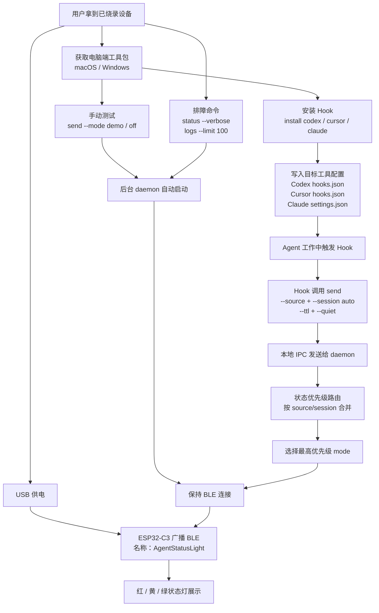

# AgentStatusLight

一个基于 **ESP32-C3 SuperMini + BLE 蓝牙** 的桌面状态灯项目，用红绿灯挂件直观显示 Cursor Agent / AI 编程过程中的状态，例如思考中、执行中、成功、失败、等待用户操作等。

***

## 使用手册

面向最终用户的安装、Hook 配置、日常命令和排障说明见：

```text
docs/USER_MANUAL.md
```

面向开发和落地实现的技术方案见：

```text
docs/TECHNICAL_DESIGN.md
```

技术方案约定电脑端整体采用 Adapter 模式：Agent stdin、Hook 安装、IPC、BLE、runtime、日志和平台差异都通过独立 adapter 接入，核心只处理统一事件、状态路由和灯效模式。

***

## 1. 项目简介

ESP32-C3 状态灯 将一个普通的红绿灯挂件改造成可由电脑Agent控制的桌面状态灯。

核心思路：

- 使用 **ESP32-C3 SuperMini** 作为主控。
- 复用红绿灯挂件内部原有三色灯板。
- 通过 **BLE 蓝牙** 接收电脑端脚本发送的状态指令。
- 结合 Cursor Hooks，让 Cursor Agent 的工作状态自动映射到灯效。

本项目不依赖 Wi-Fi，电脑可以继续连接 5GHz 网络。ESP32-C3 只负责 BLE 通信和灯效控制。

***

## 2. 整体流程图



***

## 3. 效果预览

典型状态映射：

| 场景        | 模式         | 灯效       |
| --------- | ---------- | -------- |
| 开机展示      | `demo`     | 自动展示多种灯效 |
| AI 正在分析   | `thinking` | 连贯跑马灯    |
| AI 正在生成   | `ai`       | 柔和慢速跑马灯  |
| 正在执行命令    | `busy`     | 黄灯慢闪     |
| 任务成功      | `success`  | 绿灯常亮     |
| 任务失败      | `error`    | 红灯快闪     |
| 严重异常 / 阻塞 | `alarm`    | 红黄交替警灯   |
| 展示模式      | `traffic`  | 模拟红绿灯    |
| 关闭        | `off`      | 全灭       |

***

## 4. 硬件清单

| 类别 | 物料                     |  数量 | 说明                          |
| -- | ---------------------- | --: | --------------------------- |
| 主体 | 红绿灯挂件 / 玩具交通信号灯模型      | 1 个 | 淘宝 / 1688 搜“红绿灯挂件”“交通信号灯挂件” |
| 主控 | ESP32-C3 SuperMini 开发板 | 1 块 | 建议购买已焊针版本，USB-C 更方便         |
| 限流 | 220Ω 1/4w 电阻           | 3 只 | 建议买 10 只装备用                 |
| 连线 | 细导线 / 飞线               |  若干 | 推荐 30AWG 硅胶线或漆包线            |
| 供电 | USB-C 数据线              | 1 条 | 必须支持数据传输                    |
| 绝缘 | 热缩管 / 绝缘胶带             |  少量 | 用于保护焊点                      |
| 工具 | 电烙铁、焊锡丝、镊子、剪线钳         |  若干 | 需要基础焊接工具                    |
| 检测 | 万用表                    |  可选 | 推荐用于确认焊点和短路                 |

说明：

- 本方案复用原玩具灯板，不需要额外购买红、黄、绿三颗 LED。
- 改装后建议使用 USB 供电，不建议继续使用纽扣电池。
- 每路灯建议串联 220Ω 电阻，用于保护 ESP32-C3 和原灯板。

***

## 5. 硬件接线

本项目当前适配的是 **公共正极灯板**。

实测灯位：

| 灯位 | 实际颜色 | ESP32 引脚 |
| -- | ---- | -------- |
| L1 | 绿灯   | IO2      |
| L2 | 黄灯   | IO3      |
| L3 | 红灯   | IO4      |

接线方式：

```text
ESP32 3.3V  -> 原灯板 + / 原电池正极
ESP32 IO2   -> 220Ω -> L1 控制点 = 绿灯
ESP32 IO3   -> 220Ω -> L2 控制点 = 黄灯
ESP32 IO4   -> 220Ω -> L3 控制点 = 红灯

原灯板 - / 原电池负极：第一版先不要接
```

公共正极逻辑：

```text
GPIO LOW  = 灯亮
GPIO HIGH = 灯灭
```

固件中已经处理了反相输出，正常使用时不需要手动关心高低电平。

注意事项：

- 只焊接在露出的金属焊盘、元件焊脚或电阻焊点上。
- 不要焊在绿色阻焊层表面。
- 焊接完成后，先用万用表检查是否短路，再接入电脑 USB 供电。
- 如果用于成品交付，建议用热熔胶或 UV 胶固定飞线，避免拉断焊点。

***

## 6. 固件说明

固件文件：

```text
esp32c3_arduino/esp32c3_arduino.ino
```

固件特性：

- BLE 广播名：`AgentStatusLight`
- 通信方式：BLE GATT 写入字符串
- 默认开机模式：`demo`
- 支持多种状态灯效
- 内置自动超时，避免灯长时间高亮

BLE 参数：

```text
Device Name: AgentStatusLight
Service UUID: b8b7e001-7a6b-4f4f-9a8b-11c0ffee0001
Mode Characteristic UUID: b8b7e002-7a6b-4f4f-9a8b-11c0ffee0001
```

***

## 7. 烧录固件

### 7.1 安装 Arduino IDE

前往 Arduino 官方页面下载 Arduino IDE 2.x：

```text
https://www.arduino.cc/en/software
```

macOS：

1. 下载 macOS 版本。
2. 打开 `.dmg`。
3. 将 Arduino IDE 拖入 Applications。
4. 首次打开如有安全提示，按系统提示允许。

Windows：

1. 下载 Windows 安装包。
2. 按安装向导完成安装。
3. 如果系统提示安装驱动或允许网络访问，按需允许。

***

### 7.2 安装 ESP32 开发板包

打开 Arduino IDE 后：

1. 进入左侧 **Boards Manager**。
2. 搜索 `esp32`。
3. 安装 **esp32 by Espressif Systems**。
4. 安装完成后重启 Arduino IDE。

注意：不要把 **Arduino ESP32 Boards by Arduino** 作为本项目的主要板包。

***

### 7.3 选择开发板和端口

连接 ESP32-C3 SuperMini 后，在 Arduino IDE 中选择：

```text
Board: ESP32C3 Dev Module
Port: 选择带 USB 标识的串口
```

常见端口：

| 系统      | 端口示例                                     |
| ------- | ---------------------------------------- |
| macOS   | `/dev/cu.usbmodemxxxx Serial Port (USB)` |
| Windows | `COM3` / `COM5` 等                        |

推荐设置：

| 设置项             | 建议值         |
| --------------- | ----------- |
| USB CDC On Boot | Enabled     |
| Upload Speed    | 921600 或默认值 |
| Flash Size      | 4MB 或默认值    |

如果串口监视器没有输出，优先确认 `USB CDC On Boot` 是否已设为 `Enabled`，然后重新上传固件。

***

### 7.4 上传固件

1. 用 Arduino IDE 打开 `.ino` 文件。
2. 确认 Board 和 Port。
3. 点击左上角 **Upload** 按钮。
4. 上传成功时，Output 区域通常会看到：

```text
Writing at ... 100%
Hash of data verified.
Hard resetting via RTS pin...
```

如果出现 `Connecting...` 后失败，可尝试：

```text
按住 BOOT -> 点击 Upload -> 开始 Writing 后松开 BOOT
```

***

### 7.5 串口检查

打开 Serial Monitor，波特率选择：

```text
115200
```

按一下开发板 `RST`，正常会看到类似日志：

```text
Power on. Default mode: demo
Common anode BLE enhanced version.
BLE device name: AgentStatusLight
BLE advertising started.
Supported modes:
demo / thinking / ai / busy / success / error / alarm / traffic / off / red / yellow / green
```

***

## 8. BLE 控制脚本

电脑端通过 Rust 脚本控制灯效：

```bash
esp send --mode thinking
esp send --mode busy --source codex --session my-session --ttl 1800
esp status --verbose
```

### 8.1 通过脚本安装 Codex / Cursor / Claude Hook 配置

安装命令会直接写入目标工具真实可用的 Hook 配置，不再生成需要手动改造的推荐模板。
不填写 `--dir` 时安装到用户全局配置；填写 `--dir` 时安装到对应项目目录：

| 目标     | 全局配置文件                    | 项目级配置文件                       |
| ------ | ------------------------- | ----------------------------- |
| Codex  | `~/.codex/hooks.json`     | `<dir>/.codex/hooks.json`     |
| Cursor | `~/.cursor/hooks.json`    | `<dir>/.cursor/hooks.json`    |
| Claude | `~/.claude/settings.json` | `<dir>/.claude/settings.json` |

安装后还会在 AgentStatusLight 自己的固定目录中创建辅助文件：

- macOS / Linux: `~/.esp-agent-status-light`
- Windows: `C:\.esp-agent-status-light`

```text
.esp-agent-status-light/
├─ bin/ # Hook 调用的 esp 相关脚本
├─ runtime/ # daemon pid、日志、IPC 信息和 token
└─ config.[codex/cursor/claude].json # 安装清单，卸载时用于判断是否可以删除空配置文件
```

````

macOS：

```bash
esp install [codex/cursor/claude]
esp install [codex/cursor/claude] --dir .
````

Windows：

```powershell
esp.exe install [codex/cursor/claude]
esp.exe install [codex/cursor/claude] --dir .
```

安装逻辑会合并已有 JSON 配置，并在重复安装时先移除旧的  Hook 条目，避免重复触发。

### 8.2 手动测试

macOS：

```bash
esp send --mode demo
esp send --mode thinking
esp send --mode ai
esp send --mode busy
esp send --mode success
esp send --mode error
esp send --mode alarm
esp send --mode traffic
esp send --mode off
```

Windows：

```powershell
esp.exe send --mode demo
esp.exe send --mode thinking
esp.exe send --mode ai
esp.exe send --mode busy
esp.exe send --mode success
esp.exe send --mode error
esp.exe send --mode alarm
esp.exe send --mode traffic
esp.exe send --mode off
```

***

## 9. 固件模式

| mode       | 灯效说明                       | 典型用途                     |
| ---------- | -------------------------- | ------------------------ |
| `demo`     | 默认开机展示，循环展示多种灯效            | 演示、待机展示                  |
| `thinking` | 连贯跑马灯：L1 绿 -> L2 黄 -> L3 红 | AI 分析、规划中                |
| `ai`       | 柔和慢速跑马灯                    | AI 生成内容、长任务处理中           |
| `busy`     | 黄灯慢闪                       | 构建、测试、安装依赖               |
| `success`  | 绿灯常亮                       | 会话执行成功                   |
| `error`    | 红灯快闪                       | 普通失败或报错                  |
| `alarm`    | 红黄交替警灯，带短渐变                | 严重异常或阻塞（agent需要用户授权或选择时） |
| `traffic`  | 红灯闪变绿，绿灯闪变黄，循环             | 展示或自动过渡                  |
| `off`      | 全部关闭                       | 关闭灯效                     |
| `red`      | 红灯常亮                       | 单灯测试                     |
| `yellow`   | 黄灯常亮                       | 单灯测试                     |
| `green`    | 绿灯常亮                       | 单灯测试                     |

***

## 10. 自动超时规则

固件内置自动超时，避免状态灯长时间保持高亮。

| 当前模式                                                                                             | 自动行为                        |
| ------------------------------------------------------------------------------------------------ | --------------------------- |
| `demo` / `thinking` / `ai` / `busy` / `success` / `error` / `alarm` / `red` / `yellow` / `green` | 最多运行 15 分钟，然后自动进入 `traffic` |
| `traffic`                                                                                        | 最多运行 20 分钟，然后自动 `off`       |
| `off`                                                                                            | 不自动切换                       |

***

## 11. 推荐状态映射

| \[Cursor/Codex/Claude] / 开发场景 | 推荐 mode     |
| ----------------------------- | ----------- |
| Agent 开始分析需求                  | `thinking`  |
| Agent 正在生成或修改代码               | `ai`        |
| 执行终端命令 / 构建 / 测试              | `busy`      |
| 命令成功 / 构建通过 / 测试通过            | 根据场景选择合适的状态 |
| 普通失败 / 报错                     | `error`     |
| 严重阻塞 / 需要立即处理                 | `alarm`     |
| 等待用户确认 / 需要用户操作               | `alarm`     |
| 关闭灯效                          | `off`       |
| 会话完成                          | `success`   |
| 会话关闭                          | `demo`      |

常见流程：

```text
普通任务：thinking -> busy -> success / error
等待确认：thinking -> alarm
严重异常：busy -> alarm
```

### 11.1 多 Agent 状态优先级

Codex、Cursor、Claude 可能同时触发 Hook。电脑端 daemon 会按 `source + session` 保存每个会话的最新状态，并展示优先级最高的 mode，避免某个会话的 `success/off` 覆盖另一个会话正在执行的 `busy/alarm`。

Hook 安装脚本会自动为三类配置写入 source：

```text
Codex  -> --source codex  --session auto
Cursor -> --source cursor --session auto
Claude -> --source claude --session auto
```

`--session auto` 会按 `source` 匹配对应的 Agent stdin adapter，例如 Codex、Cursor、Claude 可以各自解析成不同结构体，再归一成统一的 Agent 能力事件。后续接入新 Agent 时，只需要新增该 source 的 adapter 和安装模板，不需要改动 daemon/router 等历史核心逻辑。统一能力包括 `Thinking`、`Generating`、`RunningCommand`、`WaitingForUser`、`Succeeded`、`Failed` 等，daemon 再把能力映射到最终 mode。

会话 ID 解析会优先使用 `session_id` / `sessionId` / `conversation_id` / `thread_id` / `tabId` 等字段；如果目标工具没有提供会话 ID，则使用 `cwd` / `workspace_path` / `transcript_path` 等稳定上下文字段生成哈希作为兜底 session。

优先级从高到低：

```text
alarm > error > yellow > busy > ai > thinking > success > red > green > demo > traffic > off
```

状态会在 daemon 内保留一段时间；高优先级状态过期后，会自动回落到其它仍然活跃的低优先级状态。手动执行 `esp send --mode off` 会清空所有 source/session；Hook 中的 `off` 只清除对应 source/session。

长任务可以通过 `--ttl <seconds>` 延长保留时间。安装脚本生成的 Hook 会自动带 `--quiet`、`--ttl` 和隐藏标记 `--hook-id agent-status-light`：`--quiet` 避免 warning 污染 Hook 输出，`--hook-id` 让卸载更精准。排障时可以使用：

```bash
esp status --verbose
```

查看当前所有活跃 source/session、优先级和剩余过期时间。

***

## 12. 卸载

脚本卸载：

```bash
esp uninstall [codex/cursor/claude]
esp uninstall [codex/cursor/claude] --dir .
```

卸载只会移除命令中包含 `esp send --mode` 的 Hook 条目，不会删除用户手写的其它 Hook。
