# AgentStatusLight Architecture

基于当前仓库代码实现整理的系统架构说明，覆盖：

- `esp send` 的 Hook 归一化与 IPC 投递链路
- `esp daemon` 的状态路由、TTL 清理、BLE 重连与设备写入链路
- `install` / `uninstall` 的配置写入、去重、备份与安装清单落盘关系

这份文档描述的是“当前实现”，不是未来态草图。对应核心代码主要位于：

- `src/command.rs`
- `src/router.rs`
- `src/daemon.rs`
- `src/adapters/source/*.rs`
- `src/adapters/install/*.rs`
- `src/adapters/runtime/fs.rs`

***

## 1. 总览

### 1.1 核心模块职责图

| 模块 | 当前职责 | 关键输入 | 关键输出 |
| --- | --- | --- | --- |
| `src/cli.rs` | 暴露 `daemon`、`send`、`status`、`logs`、`stop`、`ble`、`install`、`uninstall` 命令面 | 用户命令行参数 | 结构化 CLI 命令 |
| `src/command.rs` | 装配 runtime / log / platform / source registry / install registry；处理自动拉起 daemon；记录 Hook 原始 stdin；把 Hook stdin 归一后发往 IPC | CLI 参数、Hook stdin JSON | `SendPayload`、IPC 请求、状态输出 |
| `src/adapters/source/*.rs` | 按 `source` 解析 Codex / Cursor / Claude Hook JSON，抽取 `session`、`turn`、`semantics`、`capability`、`suggested_mode` | 宿主工具 Hook JSON | `AgentEvent` |
| `src/router.rs` | `resolve_mode` 与 `StateRouter`；按 `(source, session)` 维护状态池，处理 TTL、优先级、AI 保留规则 | `AgentEvent`、`SendPayload` | 当前 session 状态、全局 `effective mode` |
| `src/daemon.rs` | 独占 `LightDevice`；接收 IPC；调用 router；派发后台 BLE 同步；写前刷新最新 effective；维护 TTL 清理、断线重连和空闲自动停止后台任务 | IPC 请求、router 决策结果 | BLE 写入、`StatusResponse`、日志 |
| `src/adapters/install/*.rs` | 把统一 `HookSpec` 翻译成 Codex / Cursor / Claude 的官方配置结构 | 安装目标、配置 JSON、平台差异 | 更新后的 hooks/settings JSON |
| `src/adapters/runtime/fs.rs` / `src/runtime_lock.rs` | 统一管理 runtime 根目录、日志、IPC 信息、安装清单、稳定二进制副本路径和跨进程文件锁 | runtime root、锁 owner | `runtime/`、`bin/`、`config.<target>.json`、token 化 lock 文件 |

### 1.2 当前系统架构图

```mermaid
flowchart LR
    subgraph AgentSide["Agent / Hook 侧"]
        Agent["Codex / Cursor / Claude"]
        Hook["已安装 Hook 配置"]
        Agent --> Hook
    end

    subgraph SendProcess["单次 esp send 进程"]
        CLI["esp send"]
        Stdin["Hook stdin JSON"]
        HookInput["HookInput<br/>raw_input + parsed_json"]
        Registry["SourceAdapterRegistry"]
        Adapter["Codex / Cursor / Claude / Fallback Adapter"]
        Event["AgentEvent"]
        Resolver["resolve_mode()"]
        Payload["SendPayload"]
        IPCClient["IpcTransport Client"]

        Stdin --> HookInput
        HookInput --> Registry
        Registry --> Adapter
        Adapter --> Event
        Event --> Resolver
        Resolver --> Payload
        Payload --> IPCClient
    end

    subgraph DaemonProcess["常驻 esp daemon 进程"]
        IPCServer["IpcServer"]
        Daemon["Daemon"]
        Router["StateRouter"]
        TTL["expiry_loop()"]
        Reconnect["reconnect_loop()"]
        Idle["idle_shutdown_loop()"]
        Runtime["RuntimeStore"]
        EventLog["EventLog / JSONL"]
        DevicePort["LightDevice"]

        IPCServer --> Daemon
        Daemon --> Router
        TTL --> Router
        Reconnect --> DevicePort
        Idle --> Daemon
        Daemon --> Runtime
        Daemon --> EventLog
        Daemon --> DevicePort
    end

    subgraph Hardware["物理设备"]
        BLE["Btleplug BLE Adapter"]
        ESP32["ESP32-C3 BLE GATT"]
        Lamp["红 / 黄 / 绿灯效"]

        DevicePort --> BLE
        BLE --> ESP32
        ESP32 --> Lamp
    end

    Hook --> CLI
    Hook -. 注入 .-> Stdin
    HookInput -. raw_input / input_json .-> EventLog
    IPCClient --> IPCServer
    Runtime --> BleConfig["ble.json<br/>设备名 / UUID"]
    BleConfig --> BLE
```

### 1.3 用户使用总流程

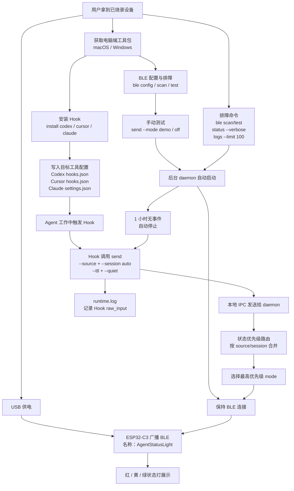

***

## 2. Hook 上报与状态路由

### 2.1 Hook 自动上报时序图

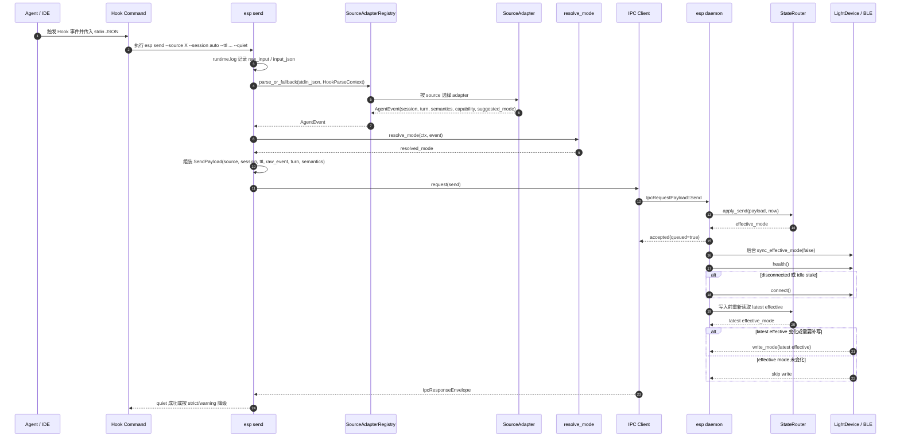

说明：`send` 在 router 接受状态后立即返回 `queued=true`，BLE 写入作为后台副作用执行。后台任务在真正写设备前会重新读取 router 的最新 effective mode，避免旧同步任务在 device lock、health 或 reconnect 上排队后，把设备写回已经过期的旧状态。

### 2.2 daemon 启动、自恢复与重连时序图

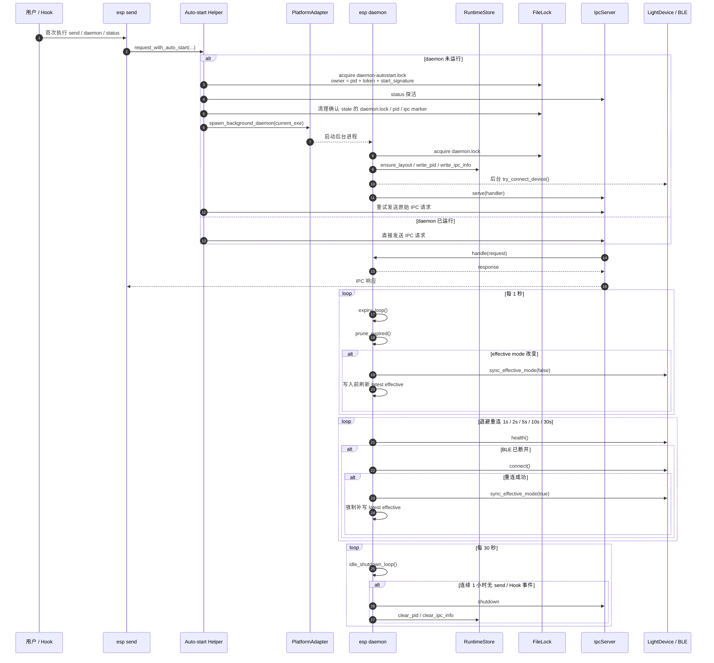

说明：`FileLock` 的 owner 使用 JSON 保存 `pid`、随机 `token` 和可选 `start_signature`。`pid` 用于判断进程是否存活，`start_signature` 用于在平台允许时识别 PID 复用，`token` 用于确保 Drop 只删除自己持有的锁文件。若启动签名不可读取，逻辑会保守地等待活跃 PID，而不是误删可能仍被持有的锁。

### 2.3 路由与覆盖规则判定图

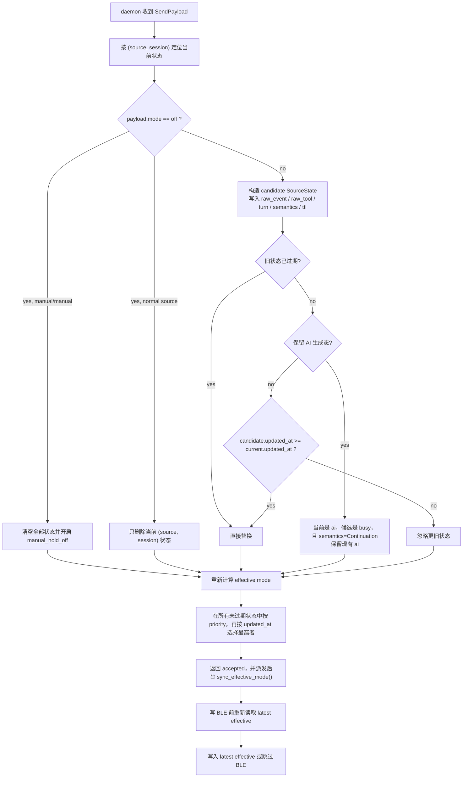

### 2.4 mode 决策优先顺序图

`esp send` 在命令侧确定最终 `mode` 的优先顺序是固定的，这一点和 daemon 里的“优先级比较”不是同一层概念：

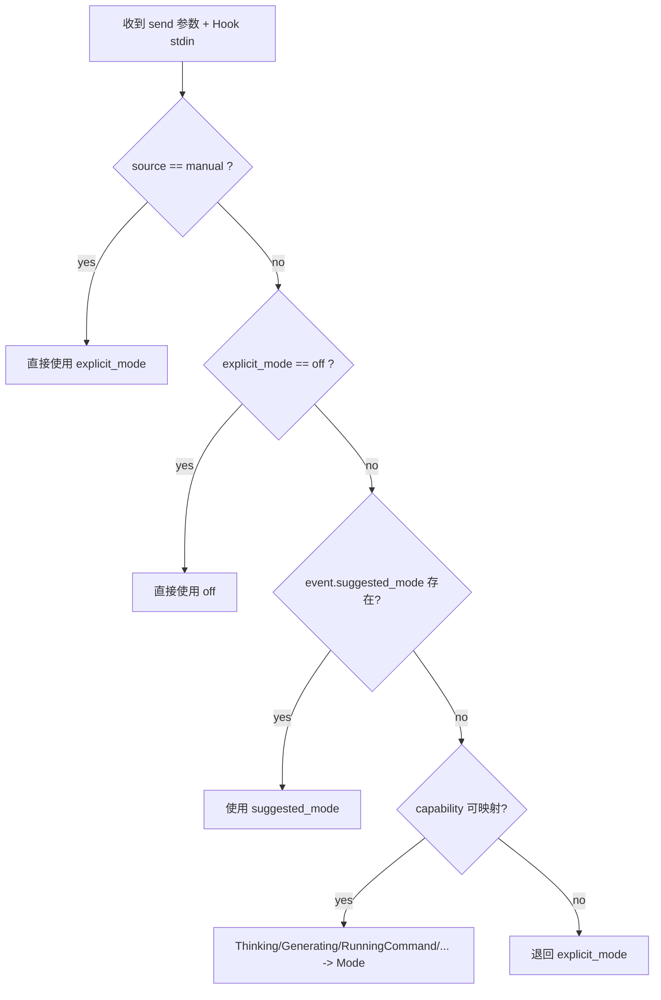

### 2.5 BLE 后台同步与写前刷新图

`send` 的成功语义是“daemon 已接受状态并排队同步设备”，不是“BLE 已完成写入”。真实 BLE 写入由后台任务尽力执行：

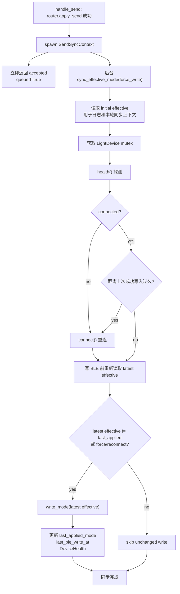

这张图的关键点是 `Refresh`：旧同步任务即使已经在 `health()`、`connect()` 或 device mutex 上等待了一段时间，也必须在真正写入前重新读取 router 的最新 effective mode。

***

## 3. 核心数据模型

### 3.1 数据模型关系图

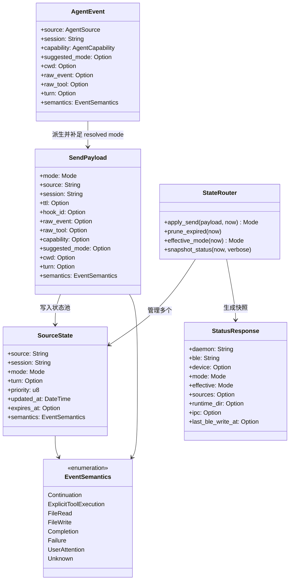

### 3.2 `turn` 与 `semantics` 的定位

| 字段 | 作用 | 来自哪里 | 当前主要用途 |
| --- | --- | --- | --- |
| `turn` | 标识“这是哪一轮 / 哪次工具调用 / 哪个 generation” | 各 source adapter 从 `turn_id`、`tool_use_id`、`generation_id` 等字段提取 | 排障、状态快照、为后续更细粒度覆盖规则保留锚点 |
| `semantics` | 标识“这条事件应该被核心层理解成什么业务语义” | 各 source adapter 把宿主私有事件名映射成统一 `EventSemantics` | 路由层判定覆盖关系，例如保护 `ai` 不被泛化 `Continuation` 的 `busy` 冲掉 |

***

## 4. Install / Uninstall 架构

### 4.1 目标配置文件落点

| 目标 | 全局配置 | 项目级配置 |
| --- | --- | --- |
| Codex | `~/.codex/hooks.json` | `<dir>/.codex/hooks.json` |
| Cursor | `~/.cursor/hooks.json` | `<dir>/.cursor/hooks.json` |
| Claude | `~/.claude/settings.json` | `<dir>/.claude/settings.json` |

补充落点：

| 类型 | 路径规则 | 作用 |
| --- | --- | --- |
| runtime 根目录 | 平台适配器决定，例如 `~/.esp-agent-status-light` | 统一保存安装清单、稳定二进制、副作用运行文件 |
| 稳定二进制副本 | `<runtime_root>/bin/esp` 或 `esp.exe` | release / 分发场景下 Hook 实际引用的命令路径 |
| BLE 配置 | `<runtime_root>/ble.json` | 保存设备名、Service UUID 和 mode characteristic UUID，供 daemon、scan、test 共用 |
| 安装清单 | `<runtime_root>/config.<target>.json` | 记录该 `target` 的多条安装记录，按 `config_path` 去重/upsert |
| daemon 运行信息 | `<runtime_root>/runtime/daemon.pid`、`ipc.json`、`daemon.lock`、`daemon-autostart.lock` | daemon 自恢复、启动串行化、排障与 `status` 查询 |
| 日志文件 | `<runtime_root>/runtime/events.log`、`runtime.log`、`runtime.lock` | `logs` 读取用户事件；runtime 链路日志用于排查；日志写入通过 token 化文件锁串行化 |

文件锁 owner 当前采用 JSON 结构，兼容旧版本 pid-only 锁文件：

```json
{
  "pid": 12345,
  "token": "random-uuid",
  "start_signature": "Mon Jun 15 12:34:56 2026"
}
```

`pid` 用于存活检查，`start_signature` 在平台允许读取时用于识别 PID 复用，`token` 用于防止旧 owner Drop 时误删新 owner 的锁。

### 4.2 install / uninstall 时序图

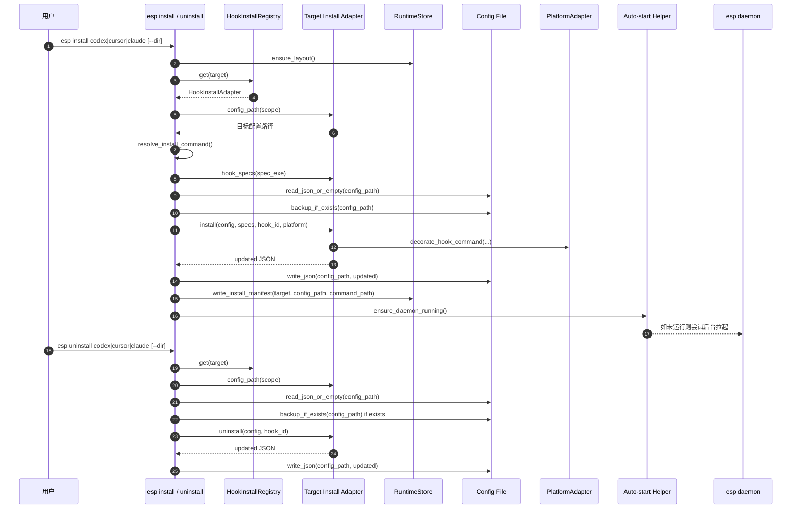

### 4.3 配置写入关系图

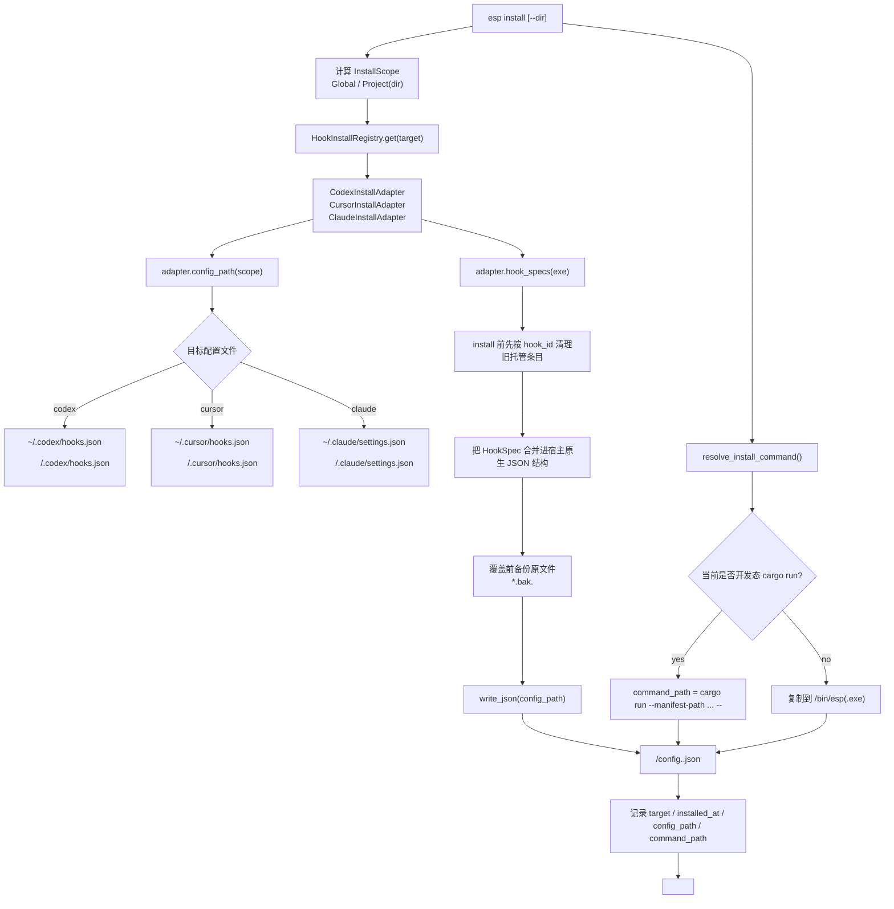

### 4.4 不同目标的配置结构差异图

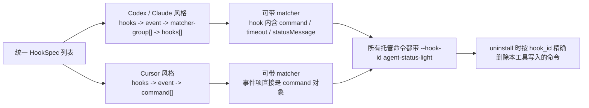

### 4.5 install / uninstall 当前实现要点

- `install` 会先执行一次逻辑级“卸载旧托管条目”，保证重复安装幂等，不会堆叠重复 Hook。
- `uninstall` 只删除命令中带 `--hook-id agent-status-light` 的托管条目，尽量不碰用户手写 Hook。
- `install` 和 `uninstall` 都会在覆盖前创建备份文件。
- `install` 会把该 `target` 的安装记录追加/更新到 `<runtime_root>/config.<target>.json`；`uninstall` 会删除对应 `config_path` 的记录，若清空则删除整个清单文件。
- `install` 在成功写入配置后，会顺手尝试确保 daemon 已启动。

***

## 5. 阅读建议

如果你是第一次读这个项目，建议顺序：

1. 先看本文件第 1 节和第 2 节，建立“Hook -> send -> IPC -> daemon -> router -> BLE”的主链路。
2. 再看第 4 节，理解为什么 install/uninstall 需要独立 adapter。
3. 对着代码阅读：
   - `src/command.rs`
   - `src/router.rs`
   - `src/daemon.rs`
   - `src/adapters/source/*.rs`
   - `src/adapters/install/*.rs`
