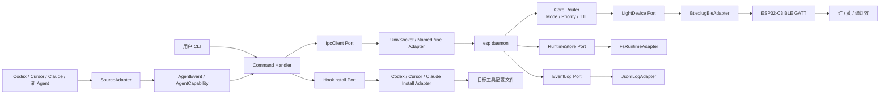

# AgentStatusLight 技术方案

## 1. 背景与目标

AgentStatusLight 是一个基于 ESP32-C3 SuperMini 和 BLE 蓝牙的桌面状态灯项目。它将红绿灯挂件改造成可由本机 Agent 工具控制的物理状态提示器，用灯效表达 Codex、Cursor、Claude 等 AI 编程工具的运行状态。

本方案面向项目落地实现，覆盖固件、电脑端 CLI、后台 daemon、本地 IPC、Hook 安装、状态优先级路由、日志排障、跨平台发布与测试验收。

### 1.1 项目目标

- 通过 BLE 控制 ESP32-C3 状态灯，不依赖 Wi-Fi。
- 提供 `esp` 命令行工具，支持手动测试、后台连接、状态查询、日志查看、Hook 安装与卸载。
- 通过后台 daemon 长期维护 BLE 连接，避免每次 Hook 触发都重新扫描和连接设备。
- 支持 Codex、Cursor、Claude 多来源、多会话同时上报状态，并按优先级展示最重要状态。
- Hook 执行失败不得阻塞 Agent 主流程，默认静默降级。
- 面向普通用户提供可安装、可排障、可卸载的工具包。

### 1.2 非目标

- 不实现云端同步、远程控制或账户系统。
- 不依赖 ESP32 Wi-Fi、MQTT 或 HTTP 服务。
- 第一阶段不做多设备编组控制，默认一台电脑连接一台 AgentStatusLight。
- 第一阶段不做图形化设置界面，所有能力通过 CLI 暴露。

## 2. 总体架构

项目整体采用 Adapter 模式，也可以理解为 Ports and Adapters 架构。核心域只处理稳定概念：`AgentEvent`、`AgentCapability`、`Mode`、`SourceState`、优先级、TTL 和 effective mode。所有外部差异都通过 adapter 接入，包括 Agent Hook stdin、Hook 配置格式、IPC 传输、BLE 后端、runtime 存储和日志输出。

核心原则：

- 核心模块不直接依赖 Codex、Cursor、Claude、macOS、Windows、btleplug、Unix Socket、Named Pipe 等具体实现。
- 每一种外部差异都落在独立 adapter 中，通过 trait 暴露稳定能力。
- 新增 Agent、新增平台、新增 BLE 后端或新增配置格式时，只新增或替换 adapter，不改历史核心逻辑。
- CLI 只做参数解析和 adapter 装配，不承载业务规则。



系统拆分为三层：

| 层级       | 职责                      | 主要文件 / 模块                                    |
| -------- | ----------------------- | -------------------------------------------- |
| ESP32 固件 | BLE GATT 服务、灯效渲染、自动超时   | `esp32c3_arduino/esp32c3_arduino.ino`        |
| 电脑端 CLI  | 参数解析、用户命令入口、adapter 装配  | `src/cli.rs`、`src/main.rs`                   |
| 后台服务     | 核心路由、port 调用、adapter 协调 | 待实现：`daemon`、`router`、`ports`、`adapters` 等模块 |

### 2.1 Adapter 边界

| 边界          | Port / Trait         | Adapter 示例                                                          | 变化原因                         |
| ----------- | -------------------- | ------------------------------------------------------------------- | ---------------------------- |
| Agent stdin | `SourceAdapter`      | `CodexAdapter`、`CursorAdapter`、`ClaudeAdapter`                      | 新 Agent、字段名变化、事件模型变化         |
| Hook 安装     | `HookInstallAdapter` | `CodexInstallAdapter`、`CursorInstallAdapter`、`ClaudeInstallAdapter` | 配置路径、JSON schema、Hook 事件能力不同 |
| IPC 客户端/服务端 | `IpcTransport`       | `UnixSocketAdapter`、`NamedPipeAdapter`、`TcpLoopbackAdapter`         | 平台差异、调试降级方案                  |
| 灯设备         | `LightDevice`        | `BtleplugBleAdapter`、`MockLightDevice`                              | BLE 库替换、测试、未来 USB/串口设备       |
| Runtime 存储  | `RuntimeStore`       | `FsRuntimeAdapter`、`MemoryRuntimeStore`                             | 文件系统路径、测试隔离、权限差异             |
| 日志          | `EventLog`           | `JsonlLogAdapter`、`MemoryEventLog`                                  | 日志格式、测试、后续 GUI 展示            |
| 平台能力        | `PlatformAdapter`    | `MacosAdapter`、`WindowsAdapter`、`LinuxAdapter`                      | 权限、路径、后台启动方式不同               |

核心模块只依赖 port，不依赖 adapter：

```rust
struct Daemon<D, R, L>
where
    D: LightDevice,
    R: RuntimeStore,
    L: EventLog,
{
    router: StateRouter,
    device: D,
    runtime: R,
    log: L,
}
```

命令入口负责根据平台和参数装配 adapter：

```rust
fn build_app_context() -> AppContext {
    AppContext {
        source_registry: SourceAdapterRegistry::default(),
        install_registry: HookInstallRegistry::default(),
        ipc: platform_ipc_transport(),
        runtime: FsRuntimeAdapter::default(),
        log: JsonlLogAdapter::default(),
        device: BtleplugBleAdapter::default(),
    }
}
```

## 3. 硬件与固件方案

### 3.1 硬件连接

项目当前适配公共正极灯板：

| 灯位 | 颜色 | ESP32 引脚 | 输出逻辑             |
| -- | -- | -------- | ---------------- |
| L1 | 绿灯 | IO2      | `LOW` 亮，`HIGH` 灭 |
| L2 | 黄灯 | IO3      | `LOW` 亮，`HIGH` 灭 |
| L3 | 红灯 | IO4      | `LOW` 亮，`HIGH` 灭 |

每路 LED 串联 220Ω 电阻。固件内部通过 PWM 反相输出屏蔽公共正极差异，电脑端只需要发送 mode 字符串。

### 3.2 BLE GATT 协议

ESP32-C3 作为 BLE Peripheral，电脑端 daemon 作为 Central。

| 项                        | 值                                      |
| ------------------------ | -------------------------------------- |
| Device Name              | `AgentStatusLight`                     |
| Service UUID             | `b8b7e001-7a6b-4f4f-9a8b-11c0ffee0001` |
| Mode Characteristic UUID | `b8b7e002-7a6b-4f4f-9a8b-11c0ffee0001` |
| Characteristic 权限        | `read` / `write` / `notify`            |
| 写入内容                     | UTF-8 mode 字符串，例如 `thinking`           |

固件只接收短字符串命令，不解析 JSON。这样可以降低固件复杂度，也便于后续用手机 BLE 工具直接调试。

### 3.3 固件模式

| mode                       | 灯效       | 用途             |
| -------------------------- | -------- | -------------- |
| `demo`                     | 循环展示多种灯效 | 开机展示、空闲展示      |
| `thinking`                 | 绿黄红连贯跑马灯 | Agent 分析与规划    |
| `ai`                       | 慢速柔和跑马灯  | Agent 生成内容     |
| `busy`                     | 黄灯慢闪     | 执行命令、构建、测试     |
| `success`                  | 绿灯常亮     | 任务完成           |
| `error`                    | 红灯快闪     | 普通失败           |
| `alarm`                    | 红黄交替警灯   | 阻塞、等待用户授权、严重异常 |
| `traffic`                  | 模拟红绿灯    | 展示或过渡状态        |
| `off`                      | 全灭       | 关闭             |
| `red` / `yellow` / `green` | 单灯常亮     | 硬件测试           |

### 3.4 自动超时

目标规则以 README 为准：

| 当前模式                                                                                             | 自动行为                      |
| ------------------------------------------------------------------------------------------------ | ------------------------- |
| `demo` / `thinking` / `ai` / `busy` / `success` / `error` / `alarm` / `red` / `yellow` / `green` | 最多运行 15 分钟，然后进入 `traffic` |
| `traffic`                                                                                        | 最多运行 20 分钟，然后进入 `off`     |
| `off`                                                                                            | 不自动切换                     |

当前固件源码中的常量仍是 5 分钟和 10 分钟，正式实现时需要统一到 README 规则，或在 README 中明确改为固件当前值。

## 4. 电脑端技术选型

### 4.1 语言与依赖

电脑端使用 Rust 实现。

| 能力       | 依赖                               | 说明                                        |
| -------- | -------------------------------- | ----------------------------------------- |
| CLI 参数解析 | `clap`                           | 已在 `src/cli.rs` 定义命令结构                    |
| 异步运行时    | `tokio`                          | daemon、IPC、BLE 异步任务                       |
| BLE      | `btleplug`                       | 跨平台 BLE Central                           |
| 异步 trait | `async-trait`                    | 让异步 adapter trait 可以作为 trait object 注册和替换 |
| 序列化      | `serde` / `serde_json`           | IPC 请求、配置与状态输出                            |
| 时间       | `chrono`                         | 日志时间、状态过期                                 |
| 日志       | `tracing` / `tracing-subscriber` | 结构化日志与排障                                  |
| 错误处理     | `anyhow`                         | CLI 入口和业务错误传播                             |
| UUID     | `uuid`                           | BLE UUID、运行态标识                            |

### 4.2 目标平台

第一阶段支持：

- macOS Apple Silicon / Intel。
- Windows x64。

Linux 可复用主要代码路径，但 BLE 权限、systemd、自启动与 BlueZ 适配作为第二阶段补齐。

## 5. CLI 命令设计

当前 `src/cli.rs` 已定义完整命令面：

```text
esp daemon [--foreground]
esp send --mode <MODE> [--source <SOURCE>] [--session <SESSION>] [--ttl <SECONDS>] [--quiet] [--strict]
esp status [--verbose]
esp logs [--limit <N>]
esp stop [--force]
esp install <TARGET> [--dir <DIR>]
esp uninstall <TARGET> [--dir <DIR>]
```

CLI 主入口应只做参数解析、adapter registry 装配和命令分发。具体业务逻辑拆分到独立模块，避免 `main.rs` 膨胀。

`install` / `uninstall` 的 `TARGET` 不能在 CLI 类型中写死成 `codex|cursor|claude` 枚举，否则新增 Agent 时仍然需要修改历史 CLI 代码。实现时应使用 `String` 接收目标名，再交给 `HookInstallRegistry` 校验：

```rust
Install {
    target: String,
    dir: Option<PathBuf>,
}

Uninstall {
    target: String,
    dir: Option<PathBuf>,
}
```

目标不存在时返回稳定错误码：

```json
{
  "ok": false,
  "code": "unknown_install_target",
  "message": "unknown install target: warp"
}
```

后续可增加 `esp adapters` 或 `esp install --list` 展示当前注册的 `SourceAdapter` / `HookInstallAdapter`，便于用户确认可接入目标。

建议模块结构：

```text
src/
├─ main.rs
├─ cli.rs
├─ command.rs          # CLI 命令分发，只编排 port，不写业务规则
├─ daemon.rs           # daemon 生命周期，只依赖 ports
├─ router.rs           # source/session 状态池与优先级，纯核心逻辑
├─ model.rs            # Mode、AgentEvent、SourceState、StatusResponse
├─ ports/
│  ├─ mod.rs
│  ├─ source.rs        # SourceAdapter
│  ├─ hook_install.rs  # HookInstallAdapter
│  ├─ ipc.rs           # IpcTransport / IpcServer
│  ├─ device.rs        # LightDevice
│  ├─ runtime.rs       # RuntimeStore
│  ├─ log.rs           # EventLog
│  └─ platform.rs      # PlatformAdapter
└─ adapters/
   ├─ mod.rs
   ├─ source/
   │  ├─ codex.rs
   │  ├─ cursor.rs
   │  ├─ claude.rs
   │  └─ fallback.rs
   ├─ install/
   │  ├─ codex.rs
   │  ├─ cursor.rs
   │  └─ claude.rs
   ├─ ipc/
   │  ├─ unix_socket.rs
   │  ├─ named_pipe.rs
   │  └─ tcp_loopback.rs
   ├─ device/
   │  ├─ btleplug_ble.rs
   │  └─ mock.rs
   ├─ runtime/fs.rs
   ├─ log/jsonl.rs
   └─ platform/
      ├─ macos.rs
      ├─ windows.rs
      └─ linux.rs
```

### 5.1 Port 定义原则

- port 只描述项目需要的能力，不暴露第三方库类型。
- adapter 内部可以依赖 `btleplug`、平台 API、JSON schema 或文件路径规则。
- 核心模块接收 trait object 或泛型 port，便于单元测试替换为 memory/mock adapter。
- adapter 错误统一转换成项目内错误码，例如 `ble_not_connected`、`ipc_unavailable`、`hook_config_invalid`。

### 5.2 异步 Adapter Trait 落地策略

Rust 的 `async fn` trait 在 trait object 场景下需要明确落地方式。第一阶段统一采用 `async-trait`，所有需要异步调用且需要注册为 trait object 的 port 都加 `#[async_trait]`，并约束为 `Send + Sync`：

```rust
use async_trait::async_trait;

#[async_trait]
trait IpcTransport: Send + Sync {
    async fn request(&self, req: IpcRequestEnvelope) -> Result<IpcResponseEnvelope, AppError>;
}

#[async_trait]
trait LightDevice: Send + Sync {
    async fn connect(&mut self) -> Result<DeviceInfo, AppError>;
    async fn write_mode(&mut self, mode: Mode) -> Result<(), AppError>;
    async fn read_mode(&mut self) -> Result<Option<Mode>, AppError>;
    async fn health(&self) -> DeviceHealth;
}
```

实现约束：

- registry 中保存 `Arc<dyn Trait + Send + Sync>` 或 `Box<dyn Trait + Send + Sync>`，避免在业务层绑定具体 adapter 类型。
- trait 方法不使用泛型参数和返回 `impl Trait`，保持 object-safe。
- adapter 内部错误统一转换成 `AppError`，不要把 `btleplug`、平台 API 或 IO 库错误类型泄漏到核心层。
- 单元测试使用 memory/mock adapter 实现同一组 trait，验证核心逻辑不依赖真实 BLE、真实 IPC 或真实文件系统。

## 6. Daemon 设计

### 6.1 启动策略

daemon 是电脑端唯一持有 `LightDevice` adapter 的进程。真实设备场景下该 adapter 通过 BLE 写入 ESP32-C3；测试或未来硬件场景可以替换成其它 adapter。

- `esp daemon --foreground`：前台运行，输出调试日志。
- `esp daemon`：后台运行，写入 pid 与 IPC 信息。
- `esp send`：如果发现 daemon 不存在，应自动尝试启动后台 daemon，然后重试 IPC 请求。
- `esp stop`：通过 IPC 优雅停止 daemon，退出前尽量向设备写入 `off`。
- `esp stop --force`：仅在 IPC 不可用时，根据 pid 文件兜底终止。

### 6.2 RuntimeStore Adapter

daemon 不直接散落读写 pid、socket 和日志路径，而是通过 `RuntimeStore` port 操作运行态文件：

```rust
trait RuntimeStore {
    fn runtime_dir(&self) -> PathBuf;
    fn read_pid(&self) -> Result<Option<u32>>;
    fn write_pid(&self, pid: u32) -> Result<()>;
    fn read_ipc_info(&self) -> Result<Option<IpcInfo>>;
    fn write_ipc_info(&self, info: &IpcInfo) -> Result<()>;
}
```

第一阶段实现：

| adapter              | 用途          |
| -------------------- | ----------- |
| `FsRuntimeAdapter`   | 真实文件系统运行态目录 |
| `MemoryRuntimeStore` | 单元测试和集成测试   |

### 6.3 运行态目录

固定目录建议与 README 保持一致：

| 平台            | 目录                                |
| ------------- | --------------------------------- |
| macOS / Linux | `~/.esp-agent-status-light`       |
| Windows       | `%LOCALAPPDATA%\AgentStatusLight` |

目录结构：

```text
<runtime-root>/
├─ bin/
│  └─ esp 或 esp.exe
├─ runtime/
│  ├─ daemon.pid
│  ├─ ipc.json
│  └─ events.log
├─ config.codex.json
├─ config.cursor.json
└─ config.claude.json
```

说明：

- `bin/` 保存 Hook 引用的稳定可执行文件副本。
- `runtime/daemon.pid` 用于判断 daemon 是否仍在运行。
- `runtime/ipc.json` 保存 IPC 地址、协议版本和启动时间。
- `runtime/events.log` 使用 JSON Lines 或简洁文本格式，保留最近 1000 条事件。

README 中 `src/cli.rs` 的长说明曾出现 `~/.agent-status-light`，需要统一为 `~/.esp-agent-status-light`。

## 7. 本地 IPC Adapter 方案

### 7.1 IPC Port

核心只依赖 `IpcTransport` / `IpcServer` port，不直接依赖 Unix Socket、Named Pipe 或 TCP：

```rust
#[async_trait]
trait IpcTransport: Send + Sync {
    async fn request(&self, req: IpcRequestEnvelope) -> Result<IpcResponseEnvelope, AppError>;
}

#[async_trait]
trait IpcServer: Send + Sync {
    async fn serve(&self, handler: IpcHandler) -> Result<(), AppError>;
}
```

建议第一阶段 adapter 选择：

| 平台            | IPC                  |
| ------------- | -------------------- |
| macOS / Linux | `UnixSocketAdapter`  |
| Windows       | `NamedPipeAdapter`   |
| 调试降级方案        | `TcpLoopbackAdapter` |

第一阶段默认禁用 TCP fallback。`TcpLoopbackAdapter` 只允许通过显式调试参数启用，例如 `--ipc tcp-loopback`，并且必须监听 `127.0.0.1` 随机端口，不写入默认安装配置。Hook 场景中本机 socket/pipe 的边界更清晰，默认只推荐 Unix Socket / Named Pipe。

### 7.2 请求响应协议

IPC payload 使用 JSON，一行一个请求，daemon 返回一行 JSON 响应。具体传输方式由 adapter 决定，核心 handler 只处理 `IpcRequestEnvelope` / `IpcResponseEnvelope`。

第一阶段 IPC 请求暂时不带 token。安全边界依赖本机 IPC transport、runtime 目录权限和 socket/pipe 文件权限。协议 envelope 预留 `auth` 字段，后续如果需要再启用 token，不破坏请求结构。

Hook stdin 的解析发生在 CLI 进程内：`esp send` 读取 stdin，调用 `SourceAdapterRegistry`，得到归一后的 `AgentEvent` 和最终 `mode` 后再发 IPC。daemon 不接收也不解析 Codex、Cursor、Claude 的原始 stdin，避免 Agent schema 泄漏到核心状态层。

请求 envelope：

```json
{
  "version": 1,
  "request_id": "018f7f4e-7b6b-7000-9000-000000000001",
  "auth": null,
  "payload": {}
}
```

发送状态：

```json
{
  "version": 1,
  "request_id": "018f7f4e-7b6b-7000-9000-000000000002",
  "auth": null,
  "payload": {
    "type": "send",
    "mode": "busy",
    "source": "codex",
    "session": "abc",
    "ttl": 1800,
    "hook_id": "agent-status-light",
    "raw_event": "PreToolUse",
    "raw_tool": "Bash",
    "capability": "RunningCommand",
    "suggested_mode": "busy",
    "cwd": "/Users/name/project"
  }
}
```

状态查询：

```json
{
  "version": 1,
  "request_id": "018f7f4e-7b6b-7000-9000-000000000003",
  "auth": null,
  "payload": {
    "type": "status",
    "verbose": true
  }
}
```

停止 daemon：

```json
{
  "version": 1,
  "request_id": "018f7f4e-7b6b-7000-9000-000000000004",
  "auth": null,
  "payload": {
    "type": "stop"
  }
}
```

统一响应：

```json
{
  "version": 1,
  "request_id": "018f7f4e-7b6b-7000-9000-000000000002",
  "ok": true,
  "message": "accepted",
  "data": {}
}
```

错误响应：

```json
{
  "version": 1,
  "request_id": "018f7f4e-7b6b-7000-9000-000000000002",
  "ok": false,
  "code": "ble_not_connected",
  "message": "device is not connected"
}
```

### 7.3 Hook stdin 处理

Hook 调用 `esp send --session auto` 时，CLI 应从 stdin 尝试读取 JSON。读取应设置较短超时或非阻塞策略，避免某些工具没有 stdin 时卡住。

不同 Agent 的 Hook stdin 结构不应在 router/daemon 中散落解析逻辑，也不建议在核心枚举中写死所有 Agent。建议在 `ports/source.rs` 定义 `SourceAdapter`，在 `adapters/source/` 下放置具体实现，并使用 source adapter 注册表按 `--source` 匹配解析器：

```rust
trait SourceAdapter {
    fn source(&self) -> &'static str;
    fn parse(&self, input: serde_json::Value, ctx: &HookParseContext) -> Result<AgentEvent, AppError>;
}

struct SourceAdapterRegistry {
    adapters: HashMap<&'static str, Box<dyn SourceAdapter + Send + Sync>>,
}
```

`SourceAdapterRegistry` 负责兜底，而不是让每个 adapter 吞掉所有错误：

```rust
impl SourceAdapterRegistry {
    fn parse_or_fallback(&self, input: serde_json::Value, ctx: &HookParseContext) -> AgentEvent {
        self.get(&ctx.source)
            .and_then(|adapter| adapter.parse(input.clone(), ctx).ok())
            .unwrap_or_else(|| FallbackAdapter.parse_lossy(input, ctx))
    }
}
```

命令入口只负责把 `--source`、CLI 显式 mode、TTL、当前目录和 stdin JSON 交给注册表：

```rust
struct HookParseContext {
    source: String,
    explicit_mode: Mode,
    current_dir: PathBuf,
    ttl: Option<Duration>,
}
```

注册表示例：

```rust
let registry = SourceAdapterRegistry::new()
    .with(CodexAdapter)
    .with(CursorAdapter)
    .with(ClaudeAdapter)
    .with(FallbackAdapter);
```

各 Agent 的原始 stdin schema 只在自己的 adapter 内部定义和解析：

```rust
// adapters/source/codex.rs
struct CodexHookInput {
    session_id: Option<String>,
    cwd: Option<String>,
    transcript_path: Option<String>,
    hook_event_name: Option<String>,
    model: Option<String>,
    turn_id: Option<String>,
    permission_mode: Option<String>,
    tool_name: Option<String>,
    tool_input: Option<serde_json::Value>,
    tool_response: Option<serde_json::Value>,
}

// adapters/source/cursor.rs
#[serde(rename_all = "camelCase")]
struct CursorHookInput {
    conversation_id: Option<String>,
    generation_id: Option<String>,
    hook_event_name: Option<String>,
    model: Option<String>,
    cursor_version: Option<String>,
    workspace_roots: Option<Vec<String>>,
    transcript_path: Option<String>,
    tool_name: Option<String>,
    tool_input: Option<serde_json::Value>,
    tool_use_id: Option<String>,
    command: Option<String>,
    status: Option<String>,
    failure_type: Option<String>,
    error_message: Option<String>,
    reason: Option<String>,
    duration: Option<u64>,
}

// adapters/source/claude.rs
struct ClaudeHookInput {
    session_id: Option<String>,
    transcript_path: Option<String>,
    cwd: Option<String>,
    hook_event_name: Option<String>,
    tool_name: Option<String>,
    tool_input: Option<serde_json::Value>,
    tool_response: Option<serde_json::Value>,
}
```

每个 adapter 解析完成后都必须归一成统一能力事件，后续模块只依赖这个结构：

```rust
struct AgentEvent {
    source: AgentSource,
    session: String,
    capability: AgentCapability,
    suggested_mode: Option<Mode>,
    cwd: Option<PathBuf>,
    raw_event: Option<String>,
    raw_tool: Option<String>,
    turn: Option<String>,
}

enum AgentCapability {
    Thinking,
    Generating,
    RunningCommand,
    WaitingForUser,
    Succeeded,
    Failed,
    Idle,
    Unknown,
}
```

source 匹配规则：

| source   | adapter           | 说明                                    |
| -------- | ----------------- | ------------------------------------- |
| `codex`  | `CodexAdapter`    | 解析 Codex Hook stdin                   |
| `cursor` | `CursorAdapter`   | 解析 Cursor Hook stdin                  |
| `claude` | `ClaudeAdapter`   | 解析 Claude settings Hook stdin         |
| 其它值      | `FallbackAdapter` | 不理解结构时只做通用 session 提取，并尊重 CLI 显式 mode |

新增 Agent 时只需要新增一个 adapter 文件，并在注册表里加入：

```rust
// adapters/source/warp.rs
struct WarpAdapter;

impl SourceAdapter for WarpAdapter {
    fn source(&self) -> &'static str {
        "warp"
    }

    fn parse(&self, input: serde_json::Value, ctx: &HookParseContext) -> Result<AgentEvent, AppError> {
        let raw: WarpHookInput = serde_json::from_value(input)?;
        Ok(raw.into_agent_event(ctx))
    }
}
```

新增接入不应修改 `router`、`daemon`、`ports/device`、`ports/ipc` 等历史核心模块；最多只新增 `adapters/source/<agent>.rs`、`adapters/install/<agent>.rs`，并在对应 registry 中注册。

归一策略：

| 统一能力             | 默认 mode            | 说明                  |
| ---------------- | ------------------ | ------------------- |
| `Thinking`       | `thinking`         | Agent 分析需求、规划步骤     |
| `Generating`     | `ai`               | 生成文本、编辑文件、应用 patch  |
| `RunningCommand` | `busy`             | 执行 shell、构建、测试、安装依赖 |
| `WaitingForUser` | `alarm`            | 等待授权、确认、输入或选择       |
| `Succeeded`      | `success`          | 任务、工具调用或会话成功结束      |
| `Failed`         | `error`            | 命令失败、工具失败、会话失败      |
| `Idle`           | `demo`             | 会话空闲或结束后回落展示        |
| `Unknown`        | 保持 CLI 显式 `--mode` | 无法识别时不覆盖用户传入 mode   |

`--mode`、`SourceAdapter` 和 `suggested_mode` 的优先级必须固定，避免不同 adapter 自行决定导致行为漂移：

| 场景                                                   | 最终 mode 决策                                | 说明                                           |
| ---------------------------------------------------- | ----------------------------------------- | -------------------------------------------- |
| 手动命令，`source=manual`                                 | 使用 CLI 显式 `--mode`                        | 手动命令不依赖 stdin 和 adapter                      |
| Hook 命令，adapter 返回 `suggested_mode`                  | 使用 `suggested_mode`                       | 用于 adapter 能从原始事件判断更精确状态的场景                  |
| Hook 命令，无 `suggested_mode`，但 `capability != Unknown` | 按 `AgentCapability` 默认映射 mode             | 使用上方归一策略表                                    |
| Hook 命令，`capability = Unknown`                       | 使用 CLI 显式 `--mode`                        | 安装模板里的 `--mode` 作为兜底                         |
| Hook 命令，adapter 解析失败                                 | 使用 `FallbackAdapter`，最终使用 CLI 显式 `--mode` | 不让单个 Agent stdin schema 变化阻断 Hook            |
| CLI 显式 `--mode off`                                  | 保留 `off` 语义，不被 adapter 覆盖                 | 手动 `off` 清空全部；Hook `off` 清理对应 source/session |

因此 `explicit_mode` 是兜底，不是最高优先级。Hook 场景下优先相信 adapter 对原始事件的归一结果；手动场景下完全相信用户输入。

### 7.4 不同 Agent 的 mode 处理方式与实现

不同 Agent 的 mode 处理必须以官方 Hook 事件和 stdin 字段为输入事实。本节依据：

- Codex Hooks 官方文档：`https://developers.openai.com/codex/hooks`
- Cursor Hooks 官方文档：`https://cursor.com/cn/docs/hooks`
- Claude Code Hooks 官方文档：`https://code.claude.com/docs/zh-CN/hooks`

所有非官方字段只能作为兼容兜底，不能写入主 rule table。新增 Agent 时，只新增该 Agent 的 `SourceAdapter`、`HookInstallAdapter` 和 rule table，不改 `resolve_mode()`、router、daemon 或 BLE adapter。

不同 Agent 的 Hook 事件模型、stdin 字段和配置格式都不一样，但最终都必须走同一条处理管线：

```text
HookInstallAdapter 生成 Hook 命令
  -> Agent 触发 Hook 并把 JSON 写入 stdin
  -> esp send 读取 stdin
  -> SourceAdapter 按 source 解析官方事件
  -> AgentCapability / suggested_mode
  -> resolve_mode()
  -> IpcTransport 发送归一后的 send payload
  -> daemon 状态池
  -> effective mode
  -> LightDevice.write_mode()
```

#### 7.4.1 通用实现模型

安装 adapter 负责生成 Hook 命令，并为每个 Hook 事件写入一个兜底 `--mode`。兜底 mode 的作用是：当 stdin 为空、schema 变化或 adapter 解析失败时，仍能展示一个合理灯效。

```rust
struct HookSpec {
    target: String,
    event: String,
    matcher: Option<String>,
    fallback_mode: Mode,
    ttl: Duration,
    command: HookCommand,
}

struct HookCommand {
    exe: PathBuf,
    args: Vec<String>, // send --mode <fallback> --source <target> --session auto ...
}
```

source adapter 负责从官方 stdin 中解析更精确的事件：

```rust
struct AgentEvent {
    source: AgentSource,
    session: String,
    capability: AgentCapability,
    suggested_mode: Option<Mode>,
    cwd: Option<PathBuf>,
    raw_event: Option<String>,
    raw_tool: Option<String>,
    turn: Option<String>,
}
```

核心只通过统一函数决定最终 mode：

```rust
fn resolve_mode(ctx: &HookParseContext, event: &AgentEvent) -> Mode {
    if ctx.source == "manual" {
        return ctx.explicit_mode;
    }

    if ctx.explicit_mode == Mode::Off {
        return Mode::Off;
    }

    if let Some(mode) = event.suggested_mode {
        return mode;
    }

    match event.capability {
        AgentCapability::Thinking => Mode::Thinking,
        AgentCapability::Generating => Mode::Ai,
        AgentCapability::RunningCommand => Mode::Busy,
        AgentCapability::WaitingForUser => Mode::Alarm,
        AgentCapability::Succeeded => Mode::Success,
        AgentCapability::Failed => Mode::Error,
        AgentCapability::Idle => Mode::Demo,
        AgentCapability::Unknown => ctx.explicit_mode,
    }
}
```

每个 source adapter 内部维护自己的 rule table。rule table 的 `raw_event` 必须使用官方事件名，`tool_matcher` 只匹配官方字段中的 `tool_name`、`command` 或 matcher 语义：

```rust
struct ModeRule {
    raw_event: &'static str,
    tool_matcher: Option<ToolMatcher>,
    status_matcher: Option<StatusMatcher>,
    capability: AgentCapability,
    suggested_mode: Option<Mode>,
}
```

失败判断优先使用官方失败事件，例如 Cursor `postToolUseFailure`、Claude `PostToolUseFailure` / `PermissionDenied` / `StopFailure`。如果某个官方事件只提供 `tool_response` 或 `output`，但没有稳定的退出码字段，则第一阶段不从字符串里强行猜失败，保持 `PostToolUse` / `afterShellExecution` 的兜底 mode，等待后续事件修正。

#### 7.4.2 CodexAdapter mode 处理

Codex 官方 Hook 事件包括：`SessionStart`、`SubagentStart`、`PreToolUse`、`PermissionRequest`、`PostToolUse`、`PreCompact`、`PostCompact`、`UserPromptSubmit`、`SubagentStop`、`Stop`。

官方通用 stdin 字段包括：`session_id`、`transcript_path`、`cwd`、`hook_event_name`、`model`。turn-scoped 事件包含 `turn_id`；`SessionStart`、`PreToolUse`、`PermissionRequest`、`PostToolUse`、`UserPromptSubmit`、`SubagentStart`、`SubagentStop`、`Stop` 还包含 `permission_mode`。工具事件使用 `tool_name`、`tool_input`、`tool_response`，其中 `Bash` 和 `apply_patch` 的输入通过 `tool_input.command` 表达。

Codex matcher 语义也要进入安装 adapter：`PreToolUse` / `PermissionRequest` / `PostToolUse` 按 `tool_name` 匹配，支持 `Bash`、`apply_patch`、MCP 工具名；`apply_patch` matcher 可使用 `Edit` / `Write` 别名。`SessionStart` matcher 是 `startup|resume|clear|compact`，`PreCompact` / `PostCompact` matcher 是 `manual|auto`，`UserPromptSubmit` 和 `Stop` 不支持 matcher。

Codex mode 映射：

| Codex 官方事件 / 条件                                         | capability       | suggested mode | 说明                                         | <br />           |
| ------------------------------------------------------- | ---------------- | -------------- | ------------------------------------------ | :--------------- |
| `SessionStart`                                          | `Thinking`       | `thinking`     | 线程启动、恢复、清理或 compact 后重新进入上下文               | <br />           |
| `UserPromptSubmit`                                      | `Thinking`       | `thinking`     | 用户 prompt 即将提交                             | <br />           |
| `SubagentStart`                                         | `Thinking`       | `thinking`     | 子代理开始工作                                    | <br />           |
| `PreToolUse` + `tool_name=Bash`                         | `RunningCommand` | `busy`         | 即将执行 shell 命令                              | <br />           |
| `PreToolUse` + `tool_name=apply_patch` / matcher \`Edit | Write\`          | `Generating`   | `ai`                                       | 即将应用 patch 或编辑文件 |
| `PreToolUse` + 其它 MCP 工具                                | `RunningCommand` | `busy`         | 外部工具调用先按忙碌处理                               | <br />           |
| `PermissionRequest`                                     | `WaitingForUser` | `alarm`        | Codex 即将向用户请求授权                            | <br />           |
| `PostToolUse`                                           | `RunningCommand` | None           | 官方字段提供 `tool_response`，第一阶段不猜退出码，保留兜底 mode | <br />           |
| `PreCompact` / `PostCompact`                            | `Thinking`       | `thinking`     | 上下文压缩前后仍处于处理流程                             | <br />           |
| `SubagentStop`                                          | `Succeeded`      | `success`      | 子代理停止                                      | <br />           |
| `Stop`                                                  | `Succeeded`      | `success`      | 当前 turn 停止                                 | <br />           |

Codex 安装模板建议：

| 官方 Hook 事件 / matcher                  | 兜底命令                                                                                                    | <br />  | <br />                                                                                            |
| ------------------------------------- | ------------------------------------------------------------------------------------------------------- | :------ | :------------------------------------------------------------------------------------------------ |
| `SessionStart`                        | `esp send --mode thinking --source codex --session auto --ttl 900 --quiet --hook-id agent-status-light` | <br />  | <br />                                                                                            |
| `UserPromptSubmit`                    | `esp send --mode thinking --source codex --session auto --ttl 900 --quiet --hook-id agent-status-light` | <br />  | <br />                                                                                            |
| `PreToolUse` + matcher `Bash`         | `esp send --mode busy --source codex --session auto --ttl 1800 --quiet --hook-id agent-status-light`    | <br />  | <br />                                                                                            |
| `PreToolUse` + matcher \`apply\_patch | Edit                                                                                                    | Write\` | `esp send --mode ai --source codex --session auto --ttl 900 --quiet --hook-id agent-status-light` |
| `PermissionRequest`                   | `esp send --mode alarm --source codex --session auto --ttl 1800 --quiet --hook-id agent-status-light`   | <br />  | <br />                                                                                            |
| `Stop` / `SubagentStop`               | `esp send --mode success --source codex --session auto --ttl 30 --quiet --hook-id agent-status-light`   | <br />  | <br />                                                                                            |

#### 7.4.3 CursorAdapter mode 处理

Cursor 官方 Hook 事件包括：`preToolUse`、`postToolUse`、`postToolUseFailure`、`subagentStart`、`subagentStop`、`beforeShellExecution`、`afterShellExecution`、`beforeMCPExecution`、`afterMCPExecution`、`afterFileEdit`、`beforeReadFile`、`beforeTabFileRead`、`afterTabFileEdit`、`beforeSubmitPrompt`、`afterAgentResponse`、`afterAgentThought`、`stop`、`sessionStart`、`sessionEnd`、`preCompact`、`workspaceOpen`。

官方通用 stdin 字段包括：`conversation_id`、`generation_id`、`model`、`hook_event_name`、`cursor_version`、`workspace_roots`、`user_email`、`transcript_path`。工具类事件包含 `tool_name`、`tool_input`、`tool_use_id`、`cwd`、`agent_message`、`tool_output`、`error_message`、`failure_type`、`duration` 等事件专属字段。Shell / MCP 专用事件分别使用 `command`、`output`、`tool_name`、`tool_input`、`result_json` 等字段。

Cursor mode 映射：

| Cursor 官方事件 / 条件                                              | capability       | suggested mode | 说明                                         |
| ------------------------------------------------------------- | ---------------- | -------------- | ------------------------------------------ |
| `sessionStart`                                                | `Thinking`       | `thinking`     | Agent 会话开始                                 |
| `beforeSubmitPrompt`                                          | `Thinking`       | `thinking`     | 用户 prompt 提交前                              |
| `afterAgentThought`                                           | `Thinking`       | `thinking`     | Agent 输出思考过程                               |
| `afterAgentResponse`                                          | `Generating`     | `ai`           | Agent 输出响应内容                               |
| `preToolUse` + `tool_name=Shell`                              | `RunningCommand` | `busy`         | 通用工具执行前，Shell 按命令执行处理                      |
| `preToolUse` + `tool_name=Write/Edit/MultiEdit`               | `Generating`     | `ai`           | 文件写入或编辑                                    |
| `postToolUseFailure`                                          | `Failed`         | `error`        | 官方失败事件，包含 `error_message` / `failure_type` |
| `subagentStart`                                               | `Thinking`       | `thinking`     | Task/subagent 开始                           |
| `subagentStop` + `status=completed`                           | `Succeeded`      | `success`      | 子代理完成                                      |
| `subagentStop` + `status=error/aborted`                       | `Failed`         | `error`        | 子代理失败或中止                                   |
| `beforeShellExecution`                                        | `RunningCommand` | `busy`         | 终端命令执行前，stdin 包含 `command`                 |
| `afterShellExecution`                                         | `RunningCommand` | None           | 官方字段包含 `output` / `duration`，不稳定解析退出码      |
| `beforeMCPExecution`                                          | `RunningCommand` | `busy`         | MCP 工具执行前                                  |
| `afterMCPExecution`                                           | `RunningCommand` | None           | MCP 工具执行后，保持兜底 mode                        |
| `afterFileEdit` / `afterTabFileEdit`                          | `Generating`     | `ai`           | 文件编辑后处理                                    |
| `beforeReadFile` / `beforeTabFileRead`                        | `RunningCommand` | `busy`         | 文件读取前检查                                    |
| `stop` + `status=completed`                                   | `Succeeded`      | `success`      | Agent 完成                                   |
| `stop` + `status=aborted/error`                               | `Failed`         | `error`        | Agent 中止或失败                                |
| `sessionEnd` + `reason=completed`                             | `Idle`           | `demo`         | 会话正常结束                                     |
| `sessionEnd` + `reason=aborted/error/window_close/user_close` | `Idle`           | `demo`         | 会话结束后回落展示态；错误已由失败事件优先上报                    |
| `preCompact`                                                  | `Thinking`       | `thinking`     | 上下文压缩前                                     |
| `workspaceOpen`                                               | `Idle`           | `demo`         | 应用级工作区事件，不代表 Agent 正在执行                    |

Cursor 安装模板建议：

| 官方 Hook 事件 / matcher                 | 兜底命令                                                                                                     |
| ------------------------------------ | -------------------------------------------------------------------------------------------------------- |
| `sessionStart`                       | `esp send --mode thinking --source cursor --session auto --ttl 900 --quiet --hook-id agent-status-light` |
| `beforeSubmitPrompt`                 | `esp send --mode thinking --source cursor --session auto --ttl 900 --quiet --hook-id agent-status-light` |
| `preToolUse` + matcher `Shell`       | `esp send --mode busy --source cursor --session auto --ttl 1800 --quiet --hook-id agent-status-light`    |
| `beforeShellExecution`               | `esp send --mode busy --source cursor --session auto --ttl 1800 --quiet --hook-id agent-status-light`    |
| `afterFileEdit` / `afterTabFileEdit` | `esp send --mode ai --source cursor --session auto --ttl 900 --quiet --hook-id agent-status-light`       |
| `postToolUseFailure`                 | `esp send --mode error --source cursor --session auto --ttl 600 --quiet --hook-id agent-status-light`    |
| `stop` / `subagentStop`              | `esp send --mode success --source cursor --session auto --ttl 30 --quiet --hook-id agent-status-light`   |

#### 7.4.4 ClaudeAdapter mode 处理

Claude Code 官方 Hook 事件覆盖会话、工具、权限、通知、子代理、压缩和停止等生命周期。第一阶段 mode adapter 重点识别：`SessionStart`、`UserPromptSubmit`、`PreToolUse`、`PermissionRequest`、`PostToolUse`、`PostToolUseFailure`、`PermissionDenied`、`Notification`、`SubagentStart`、`SubagentStop`、`PreCompact`、`PostCompact`、`SessionEnd`、`Stop`、`StopFailure`。官方文档中还列出 `Setup`、`InstructionsLoaded`、`UserPromptExpansion`、`MessageDisplay`、`PostToolBatch`、`TeammateIdle`、`ConfigChange`、`Elicitation`、`ElicitationResult` 等事件，adapter 应能以 `Unknown` 或渐进 rule 支持，不应影响核心路由。

官方通用 stdin 字段包括：`session_id`、`transcript_path`、`cwd`、`hook_event_name`。工具类事件包含 `tool_name`、`tool_input`、`tool_response`；失败和权限相关事件以独立官方事件表达，不应在设计中使用未确认的 `permission_required`、`exit_code` 作为主判断条件。

Claude mode 映射：

| Claude 官方事件 / 条件                                | capability       | suggested mode | 说明                               |
| ----------------------------------------------- | ---------------- | -------------- | -------------------------------- |
| `SessionStart`                                  | `Thinking`       | `thinking`     | 会话启动                             |
| `UserPromptSubmit`                              | `Thinking`       | `thinking`     | 用户 prompt 提交                     |
| `SubagentStart`                                 | `Thinking`       | `thinking`     | 子代理开始                            |
| `PreToolUse` + `tool_name=Bash`                 | `RunningCommand` | `busy`         | 即将执行 shell 命令                    |
| `PreToolUse` + `tool_name=Edit/MultiEdit/Write` | `Generating`     | `ai`           | 即将编辑文件                           |
| `PreToolUse` + 其它工具                             | `RunningCommand` | `busy`         | 其它工具调用先按忙碌处理                     |
| `PermissionRequest`                             | `WaitingForUser` | `alarm`        | Claude 即将请求权限                    |
| `Notification`                                  | `WaitingForUser` | `alarm`        | Claude 发出通知，需要用户关注               |
| `PermissionDenied`                              | `Failed`         | `error`        | 权限被拒绝                            |
| `PostToolUseFailure`                            | `Failed`         | `error`        | 官方工具失败事件                         |
| `PostToolUse`                                   | `RunningCommand` | None           | 官方字段提供 `tool_response`，第一阶段不猜退出码 |
| `PostToolBatch`                                 | `RunningCommand` | None           | 批量工具后处理，保持兜底 mode                |
| `PreCompact` / `PostCompact`                    | `Thinking`       | `thinking`     | 上下文压缩前后                          |
| `SubagentStop`                                  | `Succeeded`      | `success`      | 子代理停止                            |
| `Stop`                                          | `Succeeded`      | `success`      | 主任务停止                            |
| `StopFailure`                                   | `Failed`         | `error`        | 停止流程失败                           |
| `SessionEnd`                                    | `Idle`           | `demo`         | 会话结束后回到展示态                       |

Claude 安装模板建议：

| 官方 Hook 事件 / matcher                                      | 兜底命令                                                                                                     | <br />  | <br />                                                                                             |
| --------------------------------------------------------- | -------------------------------------------------------------------------------------------------------- | :------ | :------------------------------------------------------------------------------------------------- |
| `SessionStart` / `UserPromptSubmit`                       | `esp send --mode thinking --source claude --session auto --ttl 900 --quiet --hook-id agent-status-light` | <br />  | <br />                                                                                             |
| `PreToolUse` + matcher `Bash`                             | `esp send --mode busy --source claude --session auto --ttl 1800 --quiet --hook-id agent-status-light`    | <br />  | <br />                                                                                             |
| `PreToolUse` + matcher \`Edit                             | MultiEdit                                                                                                | Write\` | `esp send --mode ai --source claude --session auto --ttl 900 --quiet --hook-id agent-status-light` |
| `PermissionRequest` / `Notification`                      | `esp send --mode alarm --source claude --session auto --ttl 1800 --quiet --hook-id agent-status-light`   | <br />  | <br />                                                                                             |
| `PermissionDenied` / `PostToolUseFailure` / `StopFailure` | `esp send --mode error --source claude --session auto --ttl 600 --quiet --hook-id agent-status-light`    | <br />  | <br />                                                                                             |
| `Stop` / `SubagentStop`                                   | `esp send --mode success --source claude --session auto --ttl 30 --quiet --hook-id agent-status-light`   | <br />  | <br />                                                                                             |
| `SessionEnd`                                              | `esp send --mode demo --source claude --session auto --ttl 300 --quiet --hook-id agent-status-light`     | <br />  | <br />                                                                                             |

#### 7.4.5 FallbackAdapter mode 处理

`FallbackAdapter` 用于未知 source 或 adapter 解析失败。它不猜测复杂事件，只做两件事：

1. 从通用字段中提取 session。
2. 返回 `AgentCapability::Unknown`，让 `resolve_mode()` 使用 CLI 显式 `--mode`。

```rust
impl SourceAdapter for FallbackAdapter {
    fn source(&self) -> &'static str {
        "*"
    }

    fn parse(&self, input: serde_json::Value, ctx: &HookParseContext) -> Result<AgentEvent, AppError> {
        Ok(self.parse_lossy(input, ctx))
    }
}

impl FallbackAdapter {
    fn parse_lossy(&self, input: serde_json::Value, ctx: &HookParseContext) -> AgentEvent {
        AgentEvent {
            source: AgentSource::new(ctx.source.clone()),
            session: extract_session_or_hash(&input, &ctx),
            capability: AgentCapability::Unknown,
            suggested_mode: None,
            cwd: extract_cwd(&input).or(Some(ctx.current_dir.clone())),
            raw_event: extract_raw_event(&input),
            raw_tool: extract_raw_tool(&input),
            turn: extract_turn(&input),
        }
    }
}
```

#### 7.4.6 实现步骤

第一阶段按以下顺序实现：

1. 在 `model.rs` 定义 `Mode`、`AgentCapability`、`AgentEvent`、`HookParseContext`。
2. 在 `router.rs` 实现 `resolve_mode()`，并为上方优先级表写单元测试。
3. 在 `ports/source.rs` 定义 `SourceAdapter` 和 `SourceAdapterRegistry`。
4. 在 `adapters/source/{codex,cursor,claude,fallback}.rs` 实现各自 stdin 结构、字段别名和 mode rule table。
5. 在 `command.rs` 的 `send` 流程中读取 stdin JSON，调用 registry，得到 `AgentEvent` 和最终 mode。
6. 在 `adapters/install/{codex,cursor,claude}.rs` 生成对应 HookSpec 和兜底 `--mode`。
7. 在 `status --verbose` 中展示 `source/session/raw_event/capability/effective_mode/expires_in`，方便排查映射是否正确。

会话 ID 提取由各 source adapter 负责。所有 adapter 可以复用一个通用 helper，字段优先级为：

```text
session_id
conversation_id
generation_id
```

兜底字段为：

```text
cwd
workspace_roots[0]
transcript_path
```

如果仍然没有稳定字段，则使用 `source + current_dir` 的哈希值作为 session。

这样设计同时保留三层边界：

- source adapter 层精确处理不同 stdin schema，例如字段名、事件名、嵌套结构和版本差异。
- 统一能力层只暴露 `AgentEvent` / `AgentCapability`，屏蔽 Agent 差异。
- 核心状态层只处理 mode、priority、ttl 和 BLE 写入，不随着新 Agent 接入而改动。

## 8. 状态池与优先级路由

### 8.1 数据模型

daemon 内部按 `source + session` 保存状态：

```rust
struct SourceState {
    source: String,
    session: String,
    mode: Mode,
    raw_event: Option<String>,
    raw_tool: Option<String>,
    turn: Option<String>,
    priority: u8,
    updated_at: Instant,
    expires_at: Option<Instant>,
}
```

状态池为：

```rust
HashMap<(String, String), SourceState>
```

### 8.2 优先级

优先级从高到低：

```text
alarm > error > yellow > busy > ai > thinking > success > red > green > demo > traffic > off
```

建议映射为数字：

| mode       | priority |
| ---------- | -------: |
| `alarm`    |      110 |
| `error`    |      100 |
| `yellow`   |       90 |
| `busy`     |       80 |
| `ai`       |       70 |
| `thinking` |       60 |
| `success`  |       50 |
| `red`      |       40 |
| `green`    |       30 |
| `demo`     |       20 |
| `traffic`  |       10 |
| `off`      |        0 |

同优先级时选择 `updated_at` 最新的状态。

同一个 `source + session` 内也需要避免终止事件误覆盖失败状态。更新规则如下：

| 当前状态                  | 新事件                                                            | 处理                |
| --------------------- | -------------------------------------------------------------- | ----------------- |
| `error` / `alarm` 未过期 | `success` / `demo`，且 `turn` 相同或缺失                              | 不覆盖当前状态，只刷新日志     |
| `error` / `alarm` 未过期 | 新一轮 `thinking`，且 `turn` 不同或 `raw_event` 是 prompt/session start | 允许覆盖，表示新任务开始      |
| 任意状态                  | 新事件优先级更高                                                       | 覆盖                |
| 任意状态                  | 新事件优先级相同                                                       | 取 `updated_at` 最新 |
| 任意状态                  | 新事件优先级更低                                                       | 保留当前状态，除非当前状态已过期  |

因此 `Stop`、`SubagentStop`、`sessionEnd` 这类生命周期结束事件不能无条件把同 session 的失败状态改成成功；成功态 TTL 也保持较短，用于提示完成后快速回落。

### 8.3 TTL 规则

Hook 状态必须过期，避免某个 Agent 异常退出后长期占用状态灯。

建议默认 TTL：

| mode                       | TTL   |
| -------------------------- | ----- |
| `alarm`                    | 30 分钟 |
| `busy` / `ai` / `thinking` | 15 分钟 |
| `error`                    | 10 分钟 |
| `success`                  | 30 秒  |
| `demo` / `traffic`         | 20 分钟 |
| `red` / `yellow` / `green` | 5 分钟  |
| `off`                      | 立即清理  |

用户显式传入 `--ttl` 时，取值范围为 1 到 86400 秒。

### 8.4 off 语义

- 手动执行 `esp send --mode off`，且 `source=manual`、`session=manual` 时，清空整个状态池并向设备写入 `off`。
- Hook 执行 `off` 时，只清理对应 `source + session`，然后重新计算其它活跃状态。
- 若状态池为空，daemon 可写入 `demo` 或 `off`。建议默认回落到 `demo`，用户手动 `off` 后保持 `off`。

### 8.5 BLE 写入节流

daemon 每次状态池变化后计算 effective mode。只有 effective mode 与上次写入值不同时才写 BLE，避免频繁重复写入。

后台定时任务每 1 秒清理过期状态，清理后重新计算 effective mode。

## 9. 灯设备 Adapter 与 BLE 连接管理

### 9.1 LightDevice Port

daemon 不直接依赖 `btleplug`。核心只依赖 `LightDevice` port：

```rust
trait LightDevice {
    async fn connect(&mut self) -> Result<DeviceInfo>;
    async fn write_mode(&mut self, mode: Mode) -> Result<()>;
    async fn read_mode(&mut self) -> Result<Option<Mode>>;
    async fn health(&self) -> DeviceHealth;
}
```

第一阶段实现：

| adapter              | 用途                       |
| -------------------- | ------------------------ |
| `BtleplugBleAdapter` | 真实 ESP32-C3 BLE GATT 设备  |
| `MockLightDevice`    | 单元测试、集成测试、不插硬件时跑通 daemon |

后续如果出现 USB 串口版、HTTP 网关版或多设备版，只新增对应 `LightDevice` adapter。

### 9.2 扫描与连接

daemon 启动后执行：

1. 初始化 `LightDevice` adapter。
2. 扫描广播名为 `AgentStatusLight` 或包含目标 Service UUID 的设备。
3. 连接设备。
4. 发现 GATT 服务和 characteristic。
5. 读取当前 mode，用于 status 展示。
6. 写入当前 effective mode。

如果多个设备同时出现，第一阶段选择 RSSI 最强的设备，并在日志中记录 device id。后续可增加 `esp pair` 或配置文件指定设备。

### 9.3 重连策略

- BLE 断开后立即标记 `ble=disconnected`。
- 采用指数退避重连：1s、2s、5s、10s、30s，最大 30s。
- 重连成功后写入当前 effective mode。
- `esp send` 在 BLE 断开时仍可接受请求，状态进入 daemon 状态池；连接恢复后自动补写。

### 9.4 失败降级

Hook 默认不应因 BLE 不可用而失败：

- `esp send --quiet`：发送失败不输出 warning，退出码为 0。
- `esp send --strict`：发送失败返回非 0，供手动排障和 CI 脚本使用。
- daemon 不存在且启动失败时，非 strict 模式只记录本地日志并退出 0。

## 10. Hook 安装 Adapter

### 10.1 HookInstallAdapter Port

Hook 安装和卸载也使用 Adapter 模式。核心命令只根据 `target` 从注册表中取 adapter，不直接拼具体配置文件 schema。

```rust
trait HookInstallAdapter {
    fn target(&self) -> &'static str;
    fn config_path(&self, scope: InstallScope) -> PathBuf;
    fn install(&self, config: serde_json::Value, specs: &[HookSpec]) -> Result<serde_json::Value>;
    fn uninstall(&self, config: serde_json::Value, hook_id: &str) -> Result<serde_json::Value>;
}
```

安装 registry：

```rust
let registry = HookInstallRegistry::new()
    .with(CodexInstallAdapter)
    .with(CursorInstallAdapter)
    .with(ClaudeInstallAdapter);
```

新增 Agent 时，只新增该 Agent 的 `HookInstallAdapter`，并注册到安装 registry。

### 10.2 配置路径

| 目标     | 全局配置                      | 项目配置                          |
| ------ | ------------------------- | ----------------------------- |
| Codex  | `~/.codex/hooks.json`     | `<dir>/.codex/hooks.json`     |
| Cursor | `~/.cursor/hooks.json`    | `<dir>/.cursor/hooks.json`    |
| Claude | `~/.claude/settings.json` | `<dir>/.claude/settings.json` |

### 10.3 官方配置结构

第一阶段只写官方 JSON 配置，不写 TOML 或其它配置来源。安装器必须保留用户已有 hooks，只在对应事件数组中增删 `--hook-id agent-status-light` 标记的命令。

Codex 官方 hooks.json 结构：

```json
{
  "hooks": {
    "PreToolUse": [
      {
        "matcher": "Bash",
        "hooks": [
          {
            "type": "command",
            "command": "/Users/name/.esp-agent-status-light/bin/esp send --mode busy --source codex --session auto --ttl 1800 --quiet --hook-id agent-status-light",
            "timeout": 10,
            "statusMessage": "Updating AgentStatusLight"
          }
        ]
      }
    ]
  }
}
```

Codex 注意事项：

- Codex 同时支持 `hooks.json` 和 `config.toml` inline hooks；第一阶段只写 `hooks.json`，避免 TOML 合并复杂度。
- Codex 非 managed command hook 需要用户信任。安装完成后应提示用户在 Codex 中打开 `/hooks` 审查并 trust 新增 hook。
- `commandWindows` / `command_windows` 只在需要 Windows 覆盖命令时生成。

Cursor 官方 hooks.json 结构：

```json
{
  "version": 1,
  "hooks": {
    "beforeShellExecution": [
      {
        "command": "/Users/name/.esp-agent-status-light/bin/esp send --mode busy --source cursor --session auto --ttl 1800 --quiet --hook-id agent-status-light",
        "matcher": ".*"
      }
    ],
    "postToolUseFailure": [
      {
        "command": "/Users/name/.esp-agent-status-light/bin/esp send --mode error --source cursor --session auto --ttl 600 --quiet --hook-id agent-status-light"
      }
    ]
  }
}
```

Cursor 注意事项：

- 用户级 hooks 路径相对 `~/.cursor/`，项目级 hooks 路径相对项目根目录。为避免路径歧义，AgentStatusLight 统一写绝对 `bin/esp` 路径。
- Cursor 支持 command hook 和 prompt hook；本项目只安装 command hook。
- `matcher` 是 hook 运行时筛选条件；不需要筛选时可省略。

Claude 官方 settings.json hooks 结构：

```json
{
  "hooks": {
    "PreToolUse": [
      {
        "matcher": "Bash",
        "hooks": [
          {
            "type": "command",
            "command": "/Users/name/.esp-agent-status-light/bin/esp send --mode busy --source claude --session auto --ttl 1800 --quiet --hook-id agent-status-light",
            "timeout": 10
          }
        ]
      }
    ],
    "Stop": [
      {
        "hooks": [
          {
            "type": "command",
            "command": "/Users/name/.esp-agent-status-light/bin/esp send --mode success --source claude --session auto --ttl 30 --quiet --hook-id agent-status-light",
            "timeout": 10
          }
        ]
      }
    ]
  }
}
```

Claude 注意事项：

- Claude hooks 位于 `settings.json` 的 `hooks` 字段下，事件名使用官方 PascalCase。
- `PreToolUse` / `PostToolUse` 等工具事件可使用 `matcher` 过滤工具名；`Stop` 等事件不需要 matcher。
- 本项目 hook 应始终使用 `--quiet`，避免把状态灯控制失败污染 Agent 输出。

### 10.4 安装流程

`esp install <target> [--dir <dir>]` 执行：

1. 从 `HookInstallRegistry` 按 `target` 获取 adapter。
2. 通过 adapter 解析目标配置路径。
3. 创建平台运行态目录下的 `bin` 与 `runtime` 目录。macOS / Linux 默认为 `~/.esp-agent-status-light`，Windows 默认为 `%LOCALAPPDATA%\AgentStatusLight`。
4. 复制当前 `esp` 可执行文件到固定 `bin` 目录。
5. 读取目标 JSON 配置；不存在则创建空配置。
6. 调用 adapter 移除旧的 AgentStatusLight Hook 条目。
7. 调用 adapter 一次性合并本 target 的全部 HookSpec，避免半安装状态。
8. 写入安装清单 `config.<target>.json`。
9. 尝试启动 daemon。
10. 输出安装结果和排障命令。

### 10.5 Hook 命令格式

安装器生成的 Hook 命令统一包含：

```text
esp send --mode <mode> --source <target> --session auto --ttl <seconds> --quiet --hook-id agent-status-light
```

各 Agent 的 Hook 事件模型不同，安装 adapter 应尽量映射到通用状态：

| Agent 事件       | mode       |
| -------------- | ---------- |
| 会话开始、任务开始、进入思考 | `thinking` |
| 编辑文件、生成内容      | `ai`       |
| 执行命令、工具调用      | `busy`     |
| 命令失败、任务失败      | `error`    |
| 需要用户授权、阻塞      | `alarm`    |
| 任务完成           | `success`  |

如果某个 Agent 的 Hook 能力不足以区分细粒度事件，优先保证 `busy`、`success`、`error`、`alarm` 四类核心状态。

### 10.6 JSON 合并策略

安装 adapter 必须保护用户已有配置：

- 解析 JSON 后在对应 hooks 数组中追加本工具条目。
- 重复安装前先删除包含 `--hook-id agent-status-light` 的条目。
- 兼容旧版本：也删除命令中包含 `esp send --mode` 且明显属于本工具的条目。
- 保留用户其它 Hook 和所有未知 JSON 字段；JSON 重新序列化可能改变空白格式，但不能改变配置语义。
- 写文件前创建备份，例如 `hooks.json.bak.<timestamp>`。

### 10.7 卸载流程

`esp uninstall <target> [--dir <dir>]` 执行：

1. 从 `HookInstallRegistry` 按 `target` 获取 adapter。
2. 读取目标配置。
3. 调用 adapter 删除本工具安装的 Hook 条目。
4. 如果配置文件由本工具创建且卸载后为空，可删除空配置文件。
5. 更新或删除安装清单。
6. 不删除 `bin/esp` 和 runtime，除非后续提供 `esp uninstall --all`。

## 11. 日志与状态查询

日志与状态查询也通过 port 暴露，避免 daemon 直接绑定某一种日志格式。`status` 来自核心状态快照，`logs` 来自 `EventLog` adapter。

```rust
trait EventLog {
    fn append(&self, event: LogEvent) -> Result<()>;
    fn tail(&self, limit: usize) -> Result<Vec<LogEvent>>;
}
```

第一阶段实现：

| adapter           | 用途                                |
| ----------------- | --------------------------------- |
| `JsonlLogAdapter` | 写入 `runtime/events.log`，便于 CLI 读取 |
| `MemoryEventLog`  | 单元测试                              |

### 11.1 status 输出

普通输出建议：

```json
{
  "daemon": "running",
  "ble": "connected",
  "device": "AgentStatusLight",
  "mode": "busy",
  "effective": "busy"
}
```

`--verbose` 增加：

```json
{
  "sources": [
    {
      "source": "codex",
      "session": "abc",
      "mode": "busy",
      "raw_event": "PreToolUse",
      "raw_tool": "Bash",
      "turn": "turn-123",
      "capability": "RunningCommand",
      "suggested_mode": "busy",
      "priority": 80,
      "expires_in": 1234
    }
  ],
  "runtime_dir": "/Users/name/.esp-agent-status-light",
  "ipc": "connected",
  "last_ble_write_at": "2026-06-11T10:00:00+08:00"
}
```

### 11.2 logs 输出

日志记录关键事件：

- daemon 启动 / 停止。
- IPC 请求类型、source、session、mode。
- BLE 扫描、连接、断开、重连、写入。
- Hook 安装、卸载、配置路径。
- 错误码与错误摘要。

`esp logs --limit 100` 读取最近 N 条，最多 1000 条。

日志中不记录完整 Hook stdin，避免泄露项目路径以外的敏感上下文；如需记录 session，记录哈希或截断值。

## 12. 安全与权限

- IPC 只监听本机 socket/pipe，不暴露公网端口。
- 第一阶段 IPC 请求暂时不带 token；请求 envelope 中保留 `auth: null`，后续可平滑升级为 token。
- 本机 IPC 的安全边界依赖 socket/pipe 文件权限、runtime 目录权限和仅监听本机地址。
- `TcpLoopbackAdapter` 默认禁用，只允许显式调试开启；正式 Hook 安装不得写入 TCP IPC 配置。
- runtime 目录权限应尽量限制为当前用户可读写。
- Hook 命令使用固定 `bin/esp`，避免解压目录被删除导致 Hook 失效。
- 安装 adapter 写入配置前先备份，避免配置损坏无法恢复。
- BLE 只写 mode 字符串，不接受任意代码或脚本。

## 13. 跨平台发布

跨平台差异通过 `PlatformAdapter` 隔离：

```rust
trait PlatformAdapter {
    fn runtime_root(&self) -> PathBuf;
    fn default_ipc_adapter(&self) -> Box<dyn IpcTransport>;
    fn quote_hook_command(&self, command: &HookCommand) -> String;
    fn spawn_background_daemon(&self, exe: &Path) -> Result<()>;
}
```

第一阶段实现 `MacosAdapter` 与 `WindowsAdapter`。Linux 可先保留接口和路径策略，后续补齐 BlueZ 权限、自启动和发行版差异。

### 13.1 产物

建议发布包结构：

```text
agent-status-light-macos-arm64.zip
agent-status-light-macos-x64.zip
agent-status-light-windows-x64.zip
```

包内包含：

```text
esp 或 esp.exe
README.md
docs/USER_MANUAL.md
docs/TECHNICAL_DESIGN.md
esp32c3_arduino/esp32c3_arduino.ino
```

### 13.2 macOS 注意事项

- BLE 访问需要系统蓝牙权限。
- 首次运行未签名二进制可能触发 Gatekeeper，用户手册需说明处理方式。
- 后台 daemon 第一阶段可由 `esp send` 拉起；后续可补 LaunchAgent 自启动。

### 13.3 Windows 注意事项

- 需要 Windows BLE 支持，建议 Windows 10/11。
- Hook 配置中路径需要正确处理空格和反斜杠。
- 后台 daemon 可先由 `esp send` 拉起；后续可补计划任务或服务安装。

## 14. 测试方案

### 14.1 单元测试

优先覆盖纯逻辑模块：

- mode 解析与合法性校验。
- 优先级排序。
- TTL 计算与过期清理。
- `SourceAdapter` 契约：输入不同 stdin JSON，输出统一 `AgentEvent`。
- `SourceAdapter` 失败契约：malformed JSON / schema 变化时返回错误，并由 registry 进入 `FallbackAdapter`。
- Codex/Cursor/Claude mode rule table：覆盖 thinking/ai/busy/alarm/success/error/demo。
- `resolve_mode()` 决策顺序：manual、off、suggested\_mode、capability、explicit\_mode 兜底。
- 状态池更新规则：同 session 的 `Stop` / `sessionEnd` 不覆盖未过期的 `error` / `alarm`。
- 通用 session helper：字段提取、别名兼容和哈希兜底。
- `HookInstallAdapter` 契约：多 `HookSpec` 原子合并、官方 JSON schema、重复安装去重、卸载删除。
- `RuntimeStore` 契约：pid、ipc 信息和运行态目录的读写行为。
- `IpcTransport` payload 编解码，确保 IPC send 只包含归一后的事件，不包含原始 Hook stdin。

### 14.2 集成测试

- daemon 前台启动。
- 使用 `MemoryRuntimeStore`、`MemoryEventLog`、`MockLightDevice` 跑通 daemon。
- IPC send/status/stop 全流程，分别覆盖 Unix Socket、Named Pipe 或 TCP loopback adapter。
- TCP loopback 只在显式调试开关下可用，默认安装和默认运行不启用。
- daemon 不存在时 `esp send` 自动拉起。
- `LightDevice` 不可用时 quiet/strict 退出码差异。
- 多 source/session 上报时 effective mode 正确回落。
- 新增一个测试用 `DummySourceAdapter`，验证无需修改 router/daemon 即可接入新 source。

### 14.3 硬件验收

- Arduino 串口输出正常。
- 手机 BLE 工具可发现 `AgentStatusLight` 并写入 mode。
- `esp send --mode demo/off` 可控制灯效。
- BLE 断开重连后恢复当前 effective mode。
- 固件自动超时行为符合 README。

### 14.4 Hook 验收

分别验证 Codex、Cursor、Claude：

- install 写入正确配置。
- install 写入符合官方配置结构的 Codex `hooks.json`、Cursor `hooks.json`、Claude `settings.json`。
- 重复 install 不产生重复 Hook。
- uninstall 只删除本工具 Hook。
- Agent 正常工作时经 `SourceAdapter` 归一为 thinking/busy/success/error/alarm。
- `status --verbose` 能展示 `raw_event`、`capability`、`suggested_mode` 和最终 `mode`，便于确认映射链路。
- Hook 失败不污染 Agent 输出。

## 15. 实施里程碑

### M1：核心模型与 Port 契约

- 定义 `model`、`router` 和全部 port trait。
- 使用 memory/mock adapter 跑通 mode、priority、TTL、source/session 状态池。
- 完成 `SourceAdapter`、`HookInstallAdapter`、`LightDevice` 的基础契约测试。

### M2：固件与灯设备 Adapter

- 固件支持全部 mode。
- 固件超时规则与 README 统一。
- `MockLightDevice` 可用于无硬件测试。
- `BtleplugBleAdapter` 可扫描、连接并写入 mode。
- `esp send --mode demo/off` 可用。

### M3：daemon 与 IPC Adapter

- `esp daemon --foreground` 可运行。
- `esp send` 通过 `SourceAdapter` 归一 stdin 后，再通过 `IpcTransport` 提交状态。
- `esp status` / `esp logs` / `esp stop` 可用。
- `RuntimeStore`、`EventLog`、`PlatformAdapter` 接入真实文件系统和平台路径。
- 设备断线重连和状态补写可用。

### M4：Agent Source Adapter

- Codex/Cursor/Claude `SourceAdapter` 可解析各自 stdin。
- `--session auto` 通过 source registry 提取会话并归一能力。
- Codex/Cursor/Claude mode rule table 覆盖核心状态：thinking、ai、busy、alarm、success、error、demo。
- `resolve_mode()` 单元测试覆盖手动命令、Hook suggested mode、capability 映射、fallback mode 和 off 语义。
- 新增测试 adapter 验证扩展不改核心模块。
- `--quiet` / `--strict` 行为稳定。

### M5：Hook 安装 Adapter

- Codex/Cursor/Claude 全局与项目级 install/uninstall。
- 官方 JSON schema 合并、多 HookSpec 原子写入、去重、备份。
- 固定 bin 目录与安装清单。

### M6：发布与文档

- macOS / Windows 构建包。
- 用户手册、排障手册、技术方案齐全。
- 完成硬件、CLI、Hook 端到端验收。

## 16. 风险与对策

| 风险                   | 影响                     | 对策                                                            |
| -------------------- | ---------------------- | ------------------------------------------------------------- |
| 跨平台 BLE 行为不一致        | 连接失败、写入失败              | 通过 `LightDevice` adapter 隔离 BLE 实现；保留详细日志；优先验证 macOS/Windows  |
| Hook 事件模型差异          | 状态映射不完整                | 通过 `SourceAdapter` 归一到 `AgentCapability`；按 Agent 能力渐进增强       |
| Hook 配置 schema 差异    | install/uninstall 破坏配置 | 每个目标独立 `HookInstallAdapter`；写前备份；契约测试覆盖去重和卸载                  |
| IPC 平台差异             | send/status 不稳定        | 通过 `IpcTransport` adapter 隔离 Unix Socket、Named Pipe 和显式调试 TCP |
| TCP fallback 无 token | 本机其它进程可控制灯             | 默认禁用 TCP fallback，仅显式调试开启；正式安装只使用 socket/pipe                 |
| daemon 异常退出          | 状态灯不更新                 | `esp send` 自动拉起；pid 健康检查；日志提示                                 |
| 多 Agent 状态互相覆盖       | 展示误导                   | source/session 状态池与优先级路由                                      |
| 生命周期 Stop 事件覆盖失败     | 失败被误显示为成功              | 同 session 未过期 `error` / `alarm` 不被 `success` / `demo` 覆盖      |
| 配置写入破坏用户文件           | 用户环境受损                 | 写前备份；最小化 JSON 修改；卸载只删本工具条目                                    |
| 蓝牙权限或系统限制            | 用户无法连接设备               | `PlatformAdapter` 提供平台化提示；用户手册提供权限、端口、排障步骤                    |
| README 与代码规则不一致      | 验收标准模糊                 | 将 README 作为产品规格，代码实现中同步常量和路径                                  |

## 17. 当前仓库状态与下一步

当前仓库已经具备：

- README 中完整的产品流程、硬件说明、BLE 参数、CLI 目标行为和 Hook 目标行为。
- Arduino 固件初版，支持 BLE GATT、全部 mode 和自动超时。
- Rust 空项目

